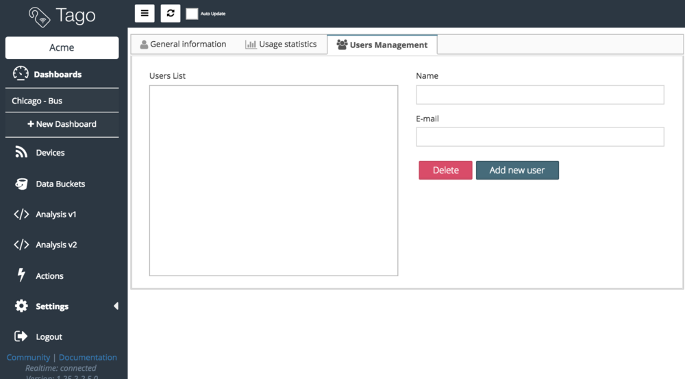
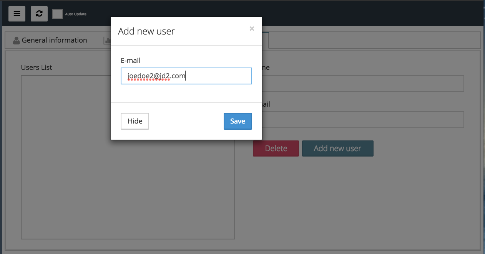
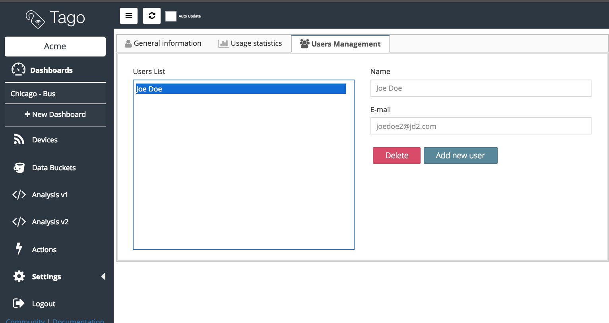
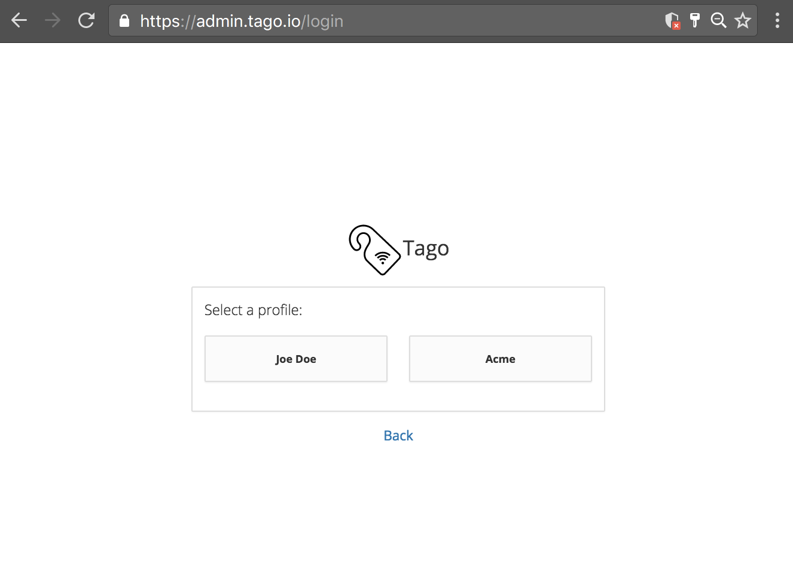
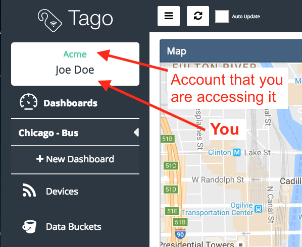

.. _ref_account_account:

#################
Users  Management
#################
Sometimes you or your organization may want to allow multiple users to access the same Tago account, for this purpose you just need to setup the Users Management section. There, you will be able to grant access to any user that already have a Tago account. Each user will have access to all your account sections but the **Settings**, which means they will not able to add new users to the list.

To access the Users Management menu, go to **Settings** > **Users Management** on Tago admin.

********************
Sharing your account
********************
You can grant access to other users by adding them in your list at the Users Management section. These users should have a Tago account. Have in mind that when are adding users in your account, you will be granting complete access to all your dashboards, devices, buckets, actions and analysis. However, they will not be able to create Account-Tokens or to access any Account Settings information. 

| To add users in your account your should:
| 1. Click on **Add new user** button;
| 2. Enter the **email** of the user that you want to share the account with;
|

If the email already exists in Tago system, the user will be added in your list.

****************************
Logging into another Account
****************************
When an user is added in at least one  account other than his/her own, an user profile options will show up during the login section.  For example, when you try to log in, and there is no account shared with you, you will be automatically redirect to your main account (no options showed). However, if someone has shared an account with you (by adding you in his or her list), a menu showing the accounts that you are allowed to login will be showed to you for selection.

In both cases, you will always be able to identify each account you are accessing by visualizing the account owner name and yours  on the top left side of the browser or mobile APP.

