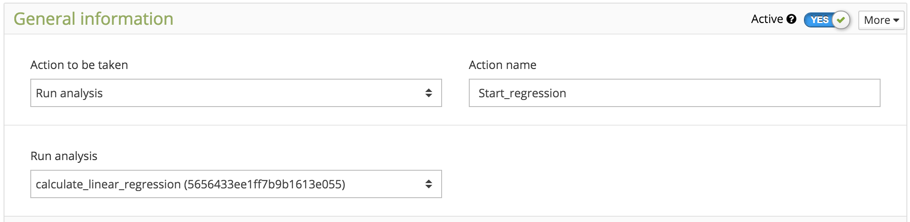
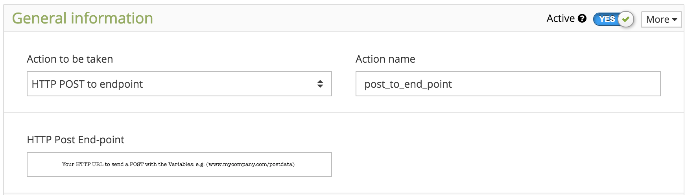

.. _ref_actions_actions:

#######
Actions
#######

**Actions** is a very powerful feature that gives you the total control over your devices based on events determined by you.
More than sending e-mail or SMS based on certain conditions, with Actions, it is also possible to send data back to the device, run scripts in the Analysis, and make a HTTP Post end-point.
With these capabilities combined, there a limitless possibilities to create any event condition, not limited to a simple if/else condition.

****************
Creating Actions
****************

To create a new Action, just click on the button 'Actions' located at the sidebar, then click 'Add action' blue button. Give a name for your action and click **Save**.

.. _ref_actions_define_actions:

****************
Defining Actions
****************

First thing to do when configuring an Action, is to define which action you want it to take. Each type of action is described in the sessions below.

Send e-mail
***********

An e-mail will be sent when the :ref:`condition <actions_set_trigger>` is met.
To create this action, select the *Action to be taken* as: **Send e-mail**, enter with the e-mail address, and a subject.

The message body can be as simple as a text: 'Hi, your car is over the speed limit'.
Or you can special fields on the message to personalize it with real-time data from your bucket and devices.
You can use most of the JSON field from our API:

1. $VARIABLE$
2. $BUCKET$
3. $VALUE$
4. $UNIT$
5. $TIME$
6. $LOCATION$
7. $DEVICE$

For example, a personalized message like this:  'Hi, your $DEVICE$ reached $VALUE$ $UNIT$ at $LOCATION$', could created an e-mail like: 'Hi, your Passat reached 73 mph at 43.0533,-86.4534'

To avoid sending e-mail continuously when a trigger condition is met, you may have to define a reset trigger condition.
Check :ref:`actions_reset_trigger` to avoid issues with your logic and even your account.

E-mails can be sent directly from scripts in the Analysis. For such action, you can use the :ref:`e-mail service <function_service_email>` .
Check the terms of use, and your plan before using the e-mail service.

Send SMS
********

An SMS will be sent when the condition :ref:`actions_set_trigger` is met.
To create this action, select the *Action to be taken* as: **Send SMS**, and enter with the phone number, including the country code. If there is no country code, the system will assume the USA code (+1).

The message body can be as simple as a text: 'Hi, your car is over the speed limit'.
Or you can specify fields in the message to personalize it with real-time data from your bucket and devices.
You can use most of the JSON fields from our API:

1. $VARIABLE$
2. $BUCKET$
3. $VALUE$
4. $UNIT$
5. $TIME$
6. $LOCATION$
7. $DEVICE$

For example, a personalized message like this:  'Hi, your $DEVICE$ reached $VALUE$ $UNIT$ at the coordinates $LOCATION$',
would text: 'Hi, you Passat reached 73 mph at the coordinates 43.05334,-86.45340'

To prevent from sending SMS's continuously when a trigger condition is met, you can define a reset trigger condition.
Check :ref:`actions_reset_trigger` to avoid issues with your logic and even with your account (high number of SMSs, for example).

SMS can also be sent directly from scripts in the Analysis. For such action, you can use the :ref:`SMS service <function_service_sms>` .

Some costs may occur when using the SMS service, which varies based on the country of operation.
Check pricing, terms of use, and your plan before using the SMS service.

Send to Device
**************

Data can be sent directly to your device by using the realtime capability of socket.io.
Of course, you can program your device to get data from the buckets using the GET method, but it may not know when to try to get data if it doesn't know if the value of the variable changed.
This action is similar to a push notification, where the information is sent to a device without the need of a GET command being issued from its side.

To create this action, you just need to select the *Action to be taken* as: **Send data do device**.

Every time the condition defined in the **Trigger Setup** is met, that variable is sent to all the devices connected to the bucket where the variable is stored.
In the example below, the variable 'setpoint' is sent to all devices connected to the bucket 'Python', every time the device 'Python' sends a new value for 'setpoit'.

Although the variable can be sent by another device, it is common to send variables that are originated by the scripts that are running in the Analysis or from a Form in the Dashboard.

**Note:** When using socket.io to receive data, the device should be in the *listening* mode. Check our out :ref:`ref_sdk_sdk` to get code example to quickly implement this function in your platform.

.. _ref_actions_run_analysis:

Run Analysis Script
*******************
Actions can also initiate scripts that runs in the Analysis.
This is a very powerful feature, as you can define when part of your code will initiate.
For example, you can initiate a data analysis every time certain data is sent from a device, or when it meets some condition.

To create this action, you need to select the *Action to be taken* as: **Run analysis**. Then, in the *Run Analysis* field, select the script that you coded and saved in the :ref:`Analysis <ref_analysis_analysis>`

HTTP Post End-Point
*******************

This action can post a data directly to an end point defined by you. When the action is initiated, it will POST the JSON data received (as defined by the variable in the Set Trigger) to HTTP address defined.

To create this action, you just need to select the *Action to be taken* as: *HTTP Post end-point*. Then, in the *HTTP Post End-point* field, enter with the HTTP address. Below, we show one example.

.. _actions_set_trigger:

******************
Defining condition
******************

In order to initiate an action process, certain conditions should be met. Internally, Tago uses *triggers* as flags to monitor this process.

Set Trigger
***********
One condition to start the action is when the selected variable meets the criteria defined in **Set Trigger**.

To configure how the event will be initiated, you need to configure the triggers.
Enter with the variable to be tested (it is tested every time a new value arrives), the Condition, and the value to be compared against.
When the condition is true, the trigger is set. Same thing for the condition defined to reset trigger.

The available test conditions are:

1. **Less than**  - condition is true when the value of the variable is less than the value defined
2. **Greater than** - condition is true when the value of the variable is greater than the value defined
3. **Equal to** - condition is true when the value of the variable is equal to the value defined
4. **Different from** - condition is true when the value of the variable is different from the value defined
5. **Any**- condition is true whenever a new value of the variable is sent to the bucket

Another condition depends on the *Define Reset Trigger Condition* switch status. If it is **NO**, the action will be taken solely based on the **Set Trigger** condition explained above.
If it is set to **YES**, the condition above will only be tested if the Trigger is not Locked.  The status of the trigger can be manually changed as showed below, that is under the session 'More'.
A more common option to unlock the trigger is to use the :ref:`actions_reset_trigger` setup.

**Note:** Combined logic tests can be easily implemented in the :ref:`ref_analysis_analysis`. For example, if you want to take an action to send an SMS
when the (temperature > 95C) AND (time_of_day == night) AND (User_at_home == false), you can simply create an Action to Run a scripts in Analysis every time
the new temperature variable arrives, and just write a simple script to make the logic test. This method is very powerful to test basically any complex combination.

.. _actions_reset_trigger:

Reset Trigger
*************

Each time a **Set Trigger** condition is met, the trigger is locked if the *Define Reset Trigger Condition* switch is set **YES**.
In this case, the **Set Trigger** condition will only be tested again when the **Reset Trigger** condition is met. This is helpful to create an hysteresis for example.

However, if the *Define Reset Trigger Condition* switch is set **NO**, the trigger will never be locked, and any time that the **Set Trigger** condition is met, it will take the defined action.
Depending on your logic, it may be undesirable.

One example of undesirable situation could occur when you want to receive only one SMS when the temperature crosses above 95 C, but instead you receive one SMS for each time a new value of temperature above 95 C is sent (unnecessary and costly).
You may want to implement an hysteresis using a **Reset Trigger** condition. If you define the condition to reset when temperature < 90 C for example, it would prevent this issue.
Only one SMS would be sent, and the system would be locked until the temperature goes below 90 C. Which seems much more reasonable in this example.
