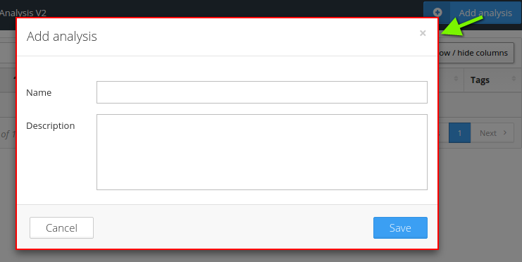
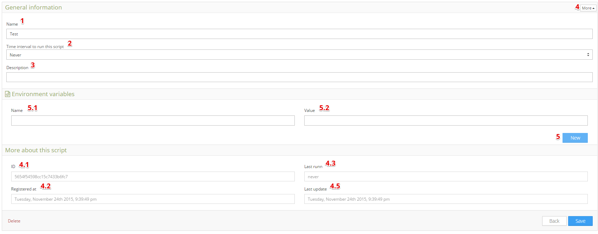
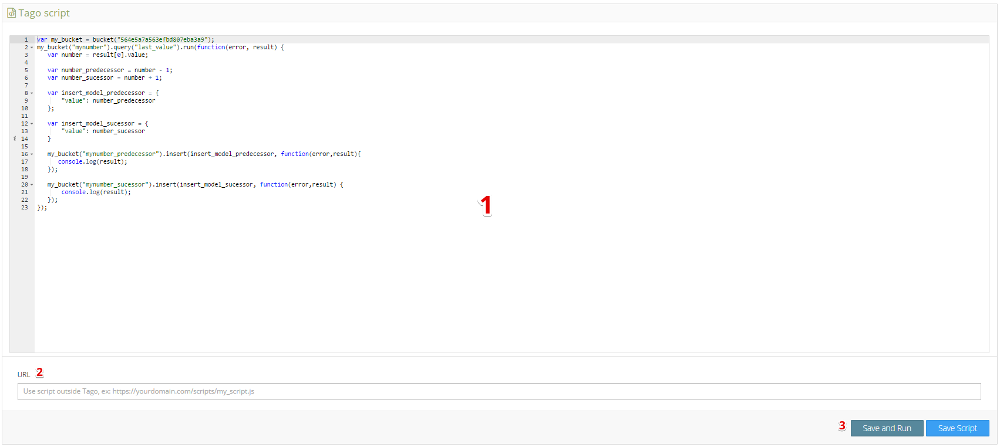
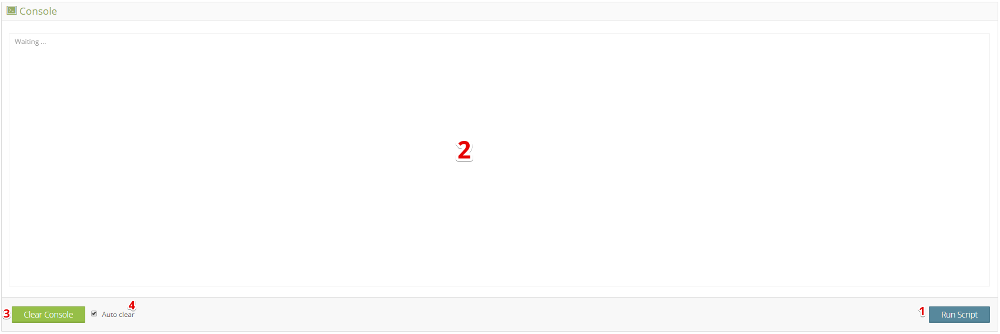

.. _ref_analysis_analysis:

########
Analysis
########

The **analysis** is a powerful feature where software developers and data scientists can use to implement scripts to analyze and manipulate the data sent by the devices in real time.

**space for gif**

Analysis is programmed using Javascript language, node.js to be more exactly. Here, you have access to all data inside your buckets, your devices, and several services provide by Tago.  We also provide some  libraries like lodash and async to optmize your code.

*******************
Setting Up Analysis
*******************
Create your own analysis is very easy. First, you need to click on Add Analysis in upper left of the analysis main screen. Just write a name and a description, and you're ready to go!

.. _analysis_general_information:

General Information
********************
When you get inside your analysis, you will come across a lot of configurations that will help you to personalize and let your analysis become unique. In the General Information area you define the *time interval* and *environment variables* that are essential to a successful modular script.

| 1. **Name**: set the analysis name;
| 2. **Time interval to run this script**: set the time period that your script will automatically run. If you want your script to be initiated by an event, select "never" and you can configure the :ref:`action <ref_actions_run_analysis>` to do it.
| 3. **Description**: set the analysis description;
| 4. **More**: Will show "more about this script" table;
|   4-1. **ID**: the script ID. Origin will automatically use this ID when none is declared;
|   4-2. **Registered at**: date when your analysis was created;
|   4-3. **Last runn**: last time the analysis was trigerred;
|   4-4. **Last update**: las time the analysis was modified;
| 5. **New Environment variable**: will add an environment variable. No need to delete, just let blank if you will not use that;
|  5-1. **Name**: the variable name. You can call a environment variable by ##name## inside your analysis;
|  5-2. **Value**: the value of the variable. Can be integer or string;
|

Script editor
******************
Tago Script is the area where you write and edit your code that will be processed by the Analysis.

| 1. **Script Area**: is where your code should be placed;
| 2. **URL**: you can host your script outside Tago, placing the url reference here;
| 3. **Save and Run**: You can "Save" or "Save and Run". The last option will immediately run your script after saving any changes;
|

Console
*******
Console acts like a common console, letting you see any error or word generated by "console.log". It is also a very good debug tool.

| 1. **Run**: will immediately run your script, if new changes are made that will be ignored. For that, you need to save your script before;
| 2. **Console Screen**: Any error or "console.log" will be show up here;
| 3. **Clear Console**: Will clear anything that are show in your console screen;
| 4. **Auto-Clear**: Clear the console everytime script runs;
|

*******************
Internal Functions
*******************
Our Analysis have a lot of functions to help you to manipulate buckets and devices. Also you can use some services to send sms, e-mails, and get informations about your account. It is possible to configure and setup almost everything in Tago through analysis.

lodash
******
You can call lodash (**_**) as a native function in analysis, without need to set it up. Lodash is a powerful library to manipulate data and compare values, you can read more about how to use it in the follow documentation: https://lodash.com/docs

| **Examples**

.. code-block:: javascript

  var my_array = [1,2,3];
  _.forEach(my_array, function(x){
    console.log(x);
  });

  //-> Will return 1, 2, 3 in each line respectively.

moment.js
*********
You can call Moment.js (**moment_tz**) as a native function in analysis without need to set it up. With Moment.js you will be able to do more complex calculations about time and date through analysis. You can read more about how to use it in the follow documentation: http://momentjs.com/docs/

| **Examples**

.. code-block:: javascript

  moment_tz("12-25-1995", "MM-DD-YYYY");
  //-> Will return a date object

async
*****
You can call async as a native function in analysis without need to set it up. This library allows you to organize your functions so you can get all the performance you need. You can read more about how to use it in the follow documentation: https://github.com/caolan/async

| **Examples**

.. code-block:: javascript

  async.parallel([functions(...)], function(error, result){
    console.log(result);
  });
  //-> Force an asynchronous functions to wait for another in order to complet a task.

bucket
******
Bucket is the most basic and valuable function in all analysis. You will need to use it always when you want to get, insert, update or delete variables on your bucket. The first pass is to select your bucket by its ID. After that, you will be able to use a lot of child functions which will allow you to manipulate your data.

| **Arguments**
| bucket("bucket_id")
| *\*bucket_id(String) You need to pass a bucket ID. Only one ID is possible.*
|
| **Returns**
| *(\*) Returns an object which you can use to do a CRUD.*
|
| **Examples**

.. code-block:: javascript

  var my_bucket = bucket("15787a4s15s4d799as");

  //-> The first line declares the bucket you will access by ID
  //-> The following line do a search for the variable "variable" inside that bucket

.query
======
Query Function allows you to do a lot of requests to your data bucket wich, in other way, will be much more difficulty. Is possible, for example, to get the max or min value of a variable, and if you combine with other functions like start_date and end_date, you can retrieve much more precisely information.

| **Arguments**
| bucket("variable").query("value").run([thisArg])
| *\*variable(String): Variable name you want to request;*
| *\*value(string): What kind of Query you will do. Could be as follow:*
|   **\*min**: *get the item with minimum value;*
|   **\*max**: *get the item with maximum value;*
|   **\*last_item**: *get the last item inserted in the variable, regardless of value or location existence;*
|   **\*last_value**: *get the last item with value, regardless of location existence;*
|   **\*last_location**: *get the last item with location, regardless of value existence;*
|   **\*count**: *get the total of items inside the variable;*
|
| **Returns**
| *(Array) An Array with desirable results.*
|
| **Examples**

.. code-block:: javascript

 my_bucket("variable").query("last_value").run(function(error, result) {
  console.log(result);
 });
 //->

.value
======
Can pass a value to be searched in your bucket. The API will respond with the location, date and other data related to that value.

| **Arguments**
| bucket_var("variable").value("value").run([thisArg])
| *\*value(String/Integer) You will need to pass a value.*
|
| **Returns**
| *(Array) Return an Array with corresponding times which this value was inserted in bucket. You can use **.query("last_value")** to get the last one.
|
|
| **Examples**

.. code-block:: javascript

  var my_bucket = bucket("15787a4s15s4d799as");
  my_bucket("color").value("blue").query("last_value").run(function(error, result) {
    console.log(result);
  });
  //->  [{"variable":"color","origin":"54ab3ee59a56af7a067b7b89","time":"2015-11-25T19:01:22.000Z","serie":1448132464126,"location":{"type":"Point","coordinates":[-78.822224,35.7469741]},"value":"blue","id":"5650bf843644b39f35a8e108"}]

.qty
=====
Limit the number of results that will be returned from a query in a array. The default value is 15.

| **Arguments**
| bucket_var("variable").qty(value).run([thisArg])
| *\*value(Integer) Number of queries to return.*
|
| **Returns**
| *(\*) Return no more than 'qty' results **
|
| **Examples**

.. code-block:: javascript

  var my_bucket = bucket("15787a4s15s4d799as");
  my_bucket("color").qty(3).run(function(error, result) {
    console.log(result);
  });
  //->  [{"variable":"color","origin":"54ab3ee59a56af7a067b7b89","time":"2015-11-25T19:01:22.000Z","serie":1448132464126,"location":{"type":"Point","coordinates":[-78.822224,35.7469741]},"value":"blue","id":"5650bf843644b39f35a8e108"},
  //->  {"variable":"color","origin":"54ab3ee59a56af7a067b7b89","time":"2015-11-25T18:47:18.000Z","serie":1448131620070,"location":{"type":"Point","coordinates":[-78.761717,35.7722995]},"value":"red","id":"5650bc3758f890b23427c976"},
  //->  {"variable":"color","origin":"54ab3ee59a56af7a067b7b89","time":"2015-11-24T18:25:43.000Z","serie":1448130323366,"location":{"type":"Point","coordinates":[-78.7617483,35.772326]},"value":"blue","id":"5650b72658f890b23427c87b"}(...)]

.start_date
============
Define the start time for the data search. Only the data containing 'time' information newer than start_date will be returned. You can combine this function with end_date to create a period. You can add others types of argument, like a moment.js, a Date, a string formatted date, or even a string date like "1 day", "2 years".

| **Arguments**
| bucket_var("variable").start_date("value").run([thisArg])
| *\*value(String/Date) Pass a string date / moment.js Date.*
|
| **Examples**

.. code-block:: javascript

  var my_bucket = bucket("15787a4s15s4d799as");
  my_bucket("color").start_date("2 day").query("last_value").run(function(error, result) {
    console.log(result);
  });
  //->  [{"variable":"color","origin":"54ab3ee59a56af7a067b7b89","time":"2015-11-25T18:25:43.000Z","serie":1448130323366,"location":{"type":"Point","coordinates":[-78.7617483,35.772326]},"value":"blue","id":"5650b72658f890b23427c87b"},
  //->  {"variable":"color","origin":"54ab3ee59a56af7a067b7b89","time":"2015-11-25T17:01:45.000Z","serie":1448125287014,"location":{"type":"Point","coordinates":[-78.6379951,35.7788033]},"value":"yellow","id":"5650a37a58f890b23427c138"},
  //->  {"variable":"color","origin":"54ab3ee59a56af7a067b7b89","time":"2015-11-24T16:25:25.000Z","serie":1448123105311,"location":{"type":"Point","coordinates":[-78.8221858,35.7469293]},"value":"red","id":"56509af53644b39f35a8d54c"}]

.end_date
==========
Define the end time for the data search. Only the data containing 'time' information older than start_date will be returned. You can combine this function with start_date to create a period. You can add others types of argument, like a moment.js, a Date, a string formatted date, or even a string date like "yesterday", "1 day", "2 years".

| **Arguments**
| bucket_var("variable").end_date("value").run([thisArg])
| *\*value(String/Date) Pass a string date / moment.js Date.*
|
| **Examples**

.. code-block:: javascript

  var my_bucket = bucket("15787a4s15s4d799as");
  my_bucket("color").start_date("2 day").query("last_value").run(function(error, result) {
    console.log(result);
  });
  //->  [{"variable":"color","origin":"54ab3ee59a56af7a067b7b89","time":"2015-11-24T18:25:43.000Z","serie":1448130323366,"location":{"type":"Point","coordinates":[-78.7617483,35.772326]},"value":"blue","id":"5650b72658f890b23427c87b"},
  //->  {"variable":"color","origin":"54ab3ee59a56af7a067b7b89","time":"2015-11-24T17:01:45.000Z","serie":1448125287014,"location":{"type":"Point","coordinates":[-78.6379951,35.7788033]},"value":"yellow","id":"5650a37a58f890b23427c138"},
  //->  {"variable":"color","origin":"54ab3ee59a56af7a067b7b89","time":"2015-11-23T16:25:25.000Z","serie":1448123105311,"location":{"type":"Point","coordinates":[-78.8221858,35.7469293]},"value":"red","id":"56509af53644b39f35a8d54c"}]

.run
=====
Every time you query any data from a bucket, "run" need to be included to add the code that will manipulate the result. This function is not useful when using *insert* or *clear*.

| **Arguments**
| bucket_var("variable").run([thisArg])
| *\*[thisArg](Function): The function invoked per iteration.*
|
| **Returns**
| *(\*) An error and result of the iteration*
|
| **Examples**

.. code-block:: javascript

  var my_bucket = bucket("15787a4s15s4d799as");
  my_bucket("color").run(function(error, result) {
    console.log(result);
  });
  //->  [{"variable":"color","origin":"54ab3ee59a56af7a067b7b89","time":"2015-11-24T19:01:22.000Z","serie":1448132464126,"location":{"type":"Point","coordinates":[-78.822224,35.7469741]},"value":"blue","id":"5650bf843644b39f35a8e108"},
  //->  {"variable":"color","origin":"54ab3ee59a56af7a067b7b89","time":"2015-11-24T18:47:18.000Z","serie":1448131620070,"location":{"type":"Point","coordinates":[-78.761717,35.7722995]},"value":"red","id":"5650bc3758f890b23427c976"}(...)]

.insert
=======
Insert data in the bucket. Different from other functions of bucket, this function don't need "run" function to work.

| **Arguments**
| bucket_var("variable").insert(JSON, "serie", [thisArg])
| *(JSON): JSON with all possible datas to insert {"value"=};*
| *\*serie(String): optional origin serie;*

.. code-block:: javascript

  {"value": "red",
  "serie" :"1448132464126",
  "time"  :"2015-11-24T18:47:18.000Z",
  "unit"  :"",
  (...)}

| *(String): A String with ID of the origin. Default is the script analysis ID.*
| *(Function): The function invoked per iteration.*
|
| **Returns**
| *(\*) An error and result of the iteration*
|
| **Examples**

.. code-block:: javascript

  var my_bucket    = bucket("15787a4s15s4d799as");
  var insert_model = {
    "value":"red"
  }
  var origin_id    = "54ab3ee59a56af7a067b7b89";

  my_bucket("color").insert(insert_model, origin_id, function(error, result) {
    console.log(result);
  });
  //->  {"message":"1 Data Added, 0 Errors","added":[{"data":{"bucket":"54ab3ee59a56af7a067b7b8a","variable":"color","created_at":"2015-11-24T01:03:30.754Z","updated_at":"2015-11-24T01:03:30.754Z","origin":"54ab3ee59a56af7a067b7b89","origin_type":"custom","time":"2015-11-24T01:03:30.754Z","value":"red","id":"5653b76296cbc40f16222c90"}}],"errors":[]}

service
*******
Service function expands your analysis limits, allowing you to use external resources, like sms and email. To use it, you only need to declare the type of service you will use.

| **Arguments**
| service("value")
| *\*value(string): Value should be one of the available services:*
|   **\*devices**
|   **\*sms**
|   **\*email**
|   **\*account**:
|
| **Examples**

.. code-block:: javascript

 var devices = service("devices");
 var sms     = service("sms");
 var email   = service("email");
 var account = service("account");

devices
=======

.. _function_service_sms:

sms
===

.. _function_service_email:

email
=====

account
=======

*******************
Internal Variables
*******************

scope
*****
Every time an action triggers a script, the variable **scope** will be generated. For example, if you do submit in a form, with a variable that have an action which will trigger any script, scope will receive a list with all values of that form. This allows you to manipulate in real time, and more easily, any new value which are inserted in your bucket.

| **Contents**
| *(Array): Always an array with all variables inserted in that moment*
|
| **Examples**

.. code-block:: javascript

  console.log(scope);
  //-> Will return ... [to-do]

##var##
*******
When using environment variables, which can be set in the :ref:`analysis_general_information` at analysis settings, you will be able to call for that variable using "##" as prefix and suffix of the declared name.

| **Examples**

.. code-block:: javascript

  console.log(##bucket_id##);
  //-> Will return the value of "bucket_id" environment variable;

  var other_var = ##bucked_id##;
  //-> "other_var" will receive "bucked_id" value;
