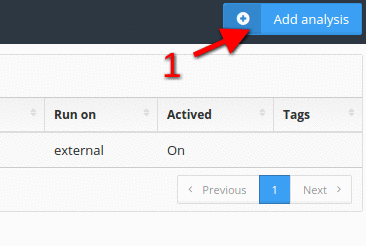
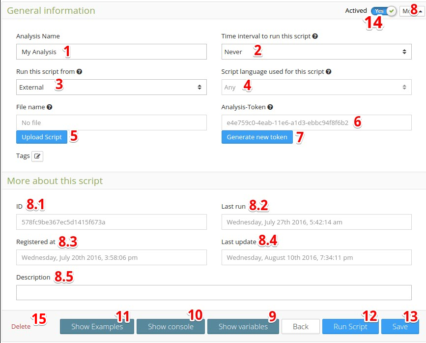
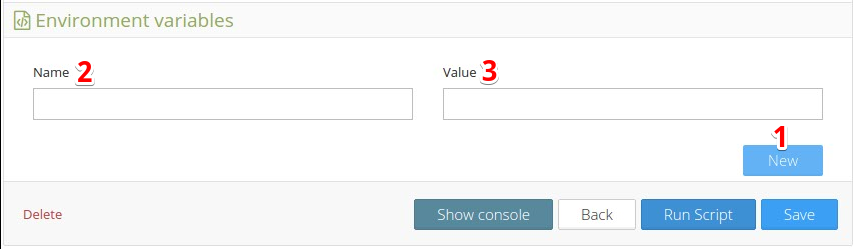
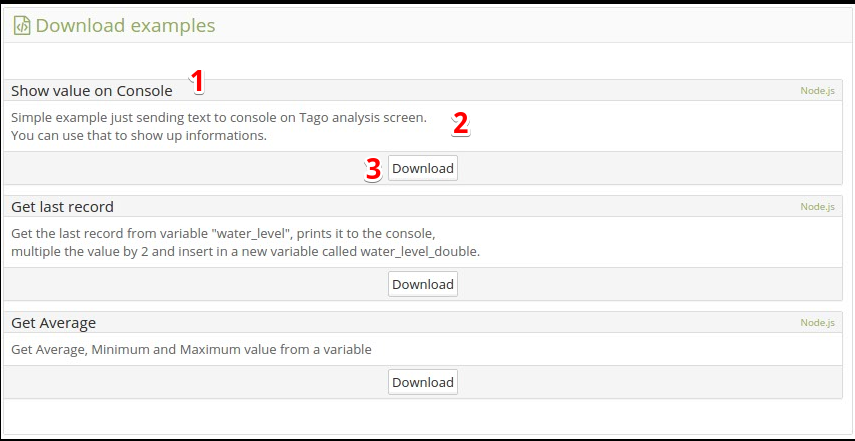

.. _ref_analysis_analysis:

########
Analysis
########
The **analysis** is a powerful feature at Tago that experts and software developers can use to implement scripts to analyze and manipulate the data sent by the devices in real time.

Analysis is programmed using Node.js Tago’s SDK. You can get more instructions on how to write an analysis script in our `SDK documentation <http://sdk.js.tago.io/en/latest/>`_.

By using the Analysis, you have access to all your data, devices, and even the services provided by Tago. One example of service is the weather that provides realtime condition data about the current and forecast weather for different locations.

Also, if you combine Analysis with Actions you can execute that script whenever a predefined variable with value arrives at Tago.
For example, you can process your data and perform a math transformation for any variable. Also you can add new values in another data bucket, get data from there, or program actions that will send email, SMS, or data back to an specific device.
If you are new at Tago, take a look at this short video that will introduce you to Tago Analysis. You will understand how the pieces are put together, and what are the steps that you need to take to start scripting today.

.. raw:: html

	 <video style="max-width: 100%;" preload="none" src="_static/analysisv2/analysis_intro.mp4"   controls></video>  

There are three main steps that you need to take in order to create and run your scripts on analysis.

| 1. Setup 
| 2. Code your script
| 3. Upload
|

********************
Creating an Analysis
********************
Create your own analysis is easy. First, you need to click on Add Analysis in the upper left of the analysis main screen. Just write a name and a description, and you’re ready to go!

.. image:: _static/analysis/analysis_new.png

1. Setup
*********
It's possible to setup the analysis in many ways. For initial purposes, we will only set the analysis to run with an external script. It allows you to run the analysis direct from your machine, and do any changes you want in realtime. After downloading the example, you need get :ref:`Analysis-Token <ref_analysis_general>` from your analysis and set inside the index.js

| 1. **Open** the specific analysis;
| 2. Select to run **"external"**;
| 3. Copy the **Analysis-Token** - you will use it later in your code;
| 4. **Press "Show Examples"** and **Download** an example;
|   4-1. Check the description of the example on the **Readme.md** for instructions of how to use it;
| 5. **Press "Show Variables"** and set the **Environment Variables** if needed;
| 7. Replace the Analysis-Token in your script with that one copied at step 3.
|

2. Code your script
*******************
Open the example with the editor of your preference, and make the changes that you need in the code as necessary. Currently, if you are wish to run your code at Tago, have in mind that Tago only supports Node.js and Python languages. However, you are free to use any language you want if your select to run the analysis in the 'external' server. It means that if you chose to program in another language, you won't be able to upload the script on Tago; you will need to run the code in your machine or another server instead.

To write your code using node.js language, follow these steps:

| 1. Inside the folder where you downloaded the example, install `npm install`;
| 2. Open the **index.js** that you downloaded from the example using your editor;
| 3. **Change** or **create** code as you want;
|

.. _ref_analysis_node_and_npm:

*Node.js and NPM*
=================
Node.js is a powerful and relative new programing language developed using JavaScript. It is a non-blocking and event-driven language that has been adopted for several developers and companies to deal with data-intensive real-time applications. You can learn about node.js `here <https://nodejs.org/en/>`._ To use Node.js you must type command-line instructions, so you need to be comfortable witha command-line tool like the Windows Command Prompt, PowerShell, Cygwin, Bash or the Git shell (which is installed along with Github for Windows).
NPM is the node package manager that as the name implies, helps with node.js programs installation, sharing, and with the dependencies management.

Warning: As you in most of the cases, developers will upload their code to run automatically on Tago server, it is necessary  to make sure that you install the most recent LTS, Long Term Support, version. Current Tago runs on the v4.4.7.   Therefore, don't use the most recent non-LTS version, unless you will only run it at your machine or another server.

| **How to Install**
| Please, open `Node.js Linux Installation Guide <https://nodejs.org/en/download/package-manager/>`_ for instructions.
| 
| **Tago SDK Install**
| The Tago SDK for Node.js is essential to help you to send instructions to Tago and run any of our examples.
| To better know how to use the SDK for coding a Analysis, use our `SDK documentation <http://sdk.js.tago.io/en/latest/>`_.
| Run `npm install tago` in your command-line tool.
|

*Python*
========
We are still working on a SDK to support the Python language. Check Other Languages if you need to program in Python before our official support.

*Other Languages*
=================
In the future, Tago will provide some SDK for other languages such as C# and C. If you still want to use them to communicate with Tago, you can check our :ref:`Api documentation <ref_api_api>` and send your own http requests.

3. Upload
*********
After you have coded and debuged your code, you can upload the script (only one file) to Tago. .

Remember that Tago will run you script using Node version 4.4.7 LTS or Python 2.7. If you are using a more recent version, you should check for compatibility before upload it. 

*All available examples for download are compatible with Tago*

| 1. If your script have **dependencies**, get our `CLI <http://sdk.js.tago.io/en/latest/analysis.html#build>`_ and build to a single file (Tago will not accept more than one file per analysis);
| 2. **Press "Upload File"** on the Analysis session that you created;
| 3. Select the **.js file**;
| 4. In the option **Run this script from **, select "Tago";
|

.. _ref_analysis_general:

*******************
General Information
*******************
When you get inside the analysis session that you created, you will come across some configuration fields that will help you to define how Tago should manage it. In the General Information area, you should define the *time interval* that your analysis (time based at a fix period of time, or per external event only), and the *environment variables* that are essential to a successful modular script.

| 1. **Analysis Name**: enter with a name for this analysis;
| 2. **Time interval to run this script**: set the time period that your script will automatically run. If you want your script to be initiated by an event, select "never" and you can configure the :ref:`action <ref_actions_run_analysis>` to do it;
| 3. **Run this script from**: select "Tago" to run script that you have uploaded from Tago server, or select "External" to run it from outside Tago - which can be from your machine or another server;
| 4. **Script language used for this script**: if you select "Tago" environment to run the script, it will need to set the code of the script. The available languages are Python and Node.js. If you select external in the previous parameter, you don't need to define the language;
| 5. **Upload Script**: Upload a *.js (node.js) or a *.py (python) file to upload the file to Tago. You can only upload one file that will run when this specific analysis is triggered. Uploading one script can't be undone, but you can disable it manually or just upload another file on top of the previous one;
| 6. **Analysis Token**: Token of the Analysis. Needed to run the analysis in a external enviroment;
| 7. **Generate new Token**: Change the analysis token to a new one;
| 8. **More**: Will show "more about this script" table;
|   8-1. **ID**: the ID of this script. Note: Origin will automatically use this ID when none is declared;
|   8-2. **Registered at**: date when your analysis was created;
|   8-3. **Last runn**: last time the analysis was triggered;
|   8-4. **Last update**: last time the analysis was modified;
|   8-5. **Description**: set the analysis description;
| 9. **Show Variables**: Show the environment variables of the analysis;
| 10. **Show Console**: Show the console of the analysis;
| 11. **Show Examples**: Show a list of analysis examples. You can download them and use as you wish;
| 12. **Run Script**: will immediately run your script;
| 13. **Save**: Save any change made in the analysis information;
| 14. **Actived**: Turn on/off the current analysis;
| 15. **Delete**: Delete current analysis;
|

Environment Variables
*********************
Enviroment Variable is a very useful resource used to send variables values to the context of your script. You can, for example, put token of accounts and devices to be used later in the script when it runs. Analysis will then get this variables as "environment" parameters and used them in the context.

| 1. **New Environment variable**: will add an environment variable. No need to delete it, just leave blank if you don't need to use it.
| 2. **Name**: the variable name.
| 3. **Value**: the value of the variable. It can be *integer* or *string*
|

Examples
********
Tago provide a list of examples to help you to understand better how to use Tago analysis service. There, you can get great examples on how to get and insert data into your database, send emails, run some calculations, and other interesting things.

All examples come with a README.md file that gives instructions to help you put the analysis to work. Remember to read it before start to modify the code.

| 1. **Name**: Name of the example;
| 2. **Description**: Description of the example;
| 3. **Download**: Download a ZIP file of the selected example.;
|

Console
*******
Use the console to monitor the variables and status of your script. You can see any error or word generated by "console.log". The console is also a very good debug tool.

.. image:: _static/analysis/analysis_console.png

| 1. **Run Script**: it will run your script immediately;
| 2. **Console Screen**: Any error or response to a "context.log" will be showed here;
| 3. **Clear Console**: it will clear everything that are showed in your console screen;
| 4. **Auto-Clear**: it will clear the console every time the script runs;
|
