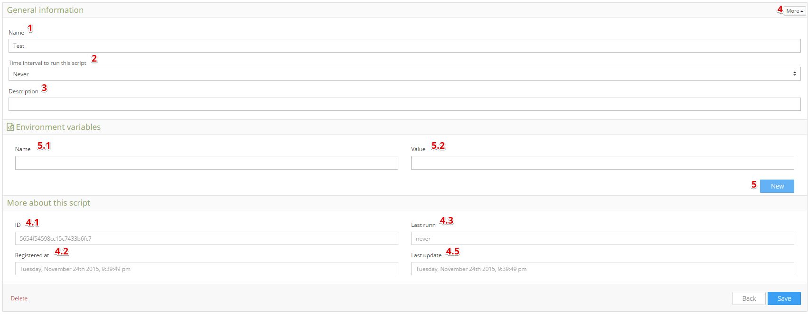

.. _ref_analysis_analysis:

###########
Analysis V2
###########
The **analysis** is a powerful feature at Tago that experts and software developers can use to implement scripts to analyze and manipulate the data sent by the devices in real time.

Analysis is programmed using Javascript Tago’s SDK. You can get more instructions on how to write an analysis script in the our `SDK documentation <http://sdk.js.tago.io/en/latest/>`_.

Here, you have access to all data inside your devices, and some services provided by Tago.

If you combine Analysis with Actions you can execute that script whenever a predefined variable with value arrives at Tago.
For example, you can process your information, as convert, transform, apply functions for that value. Also you can add new values in another bucket, get data from there or program actions such as send email, sms, etc...

*******************
Setting Up Analysis
*******************
Create your own analysis is very easy. First, you need to click on Add Analysis in the upper left of the analysis main screen. Just write a name and a description, and you're ready to go!

.. image:: _static/analysis/analysis_new.png

.. _analysis_general_information:

General Information
********************
When you get inside your analysis, you will come across some configurations that will help you to personalize your analysis. In the General Information area, you should define the *time interval* that your analysis will run continuously, and the *environment variables* that are essential to a successful modular script.

| 1. **Analysis Name**: set the analysis name;
| 2. **Time interval to run this script**: set the time period that your script will automatically run. If you want your script to be initiated by an event, select "never" and you can configure the :ref:`action <ref_actions_run_analysis>` to do it;
| 3. **Run this script from**: It's possible to select "Tago" to run script that you have uploaded to Tago, or select "External" to run script outside of tago servers, like your machine;
| 4. **Script language used for this script**: if you select "Tago" enviroment to run the script, it will need to set the code of the script. The availables are Python and Node. If you select external in the previous parameter, you don't need to set this one;
| 5. **Upload Script**: Upload a .js (node) file or .py (python) to Tago. You can only upload one file that will run when analysis is triggered. Uploading script can't be undone;
| 6. **Analysis Token**: Token of the Analysis. Needed to run the analysis in a external enviroment;
| 7. **Generate new Token**: Change the analysis token to a new one;
| 8. **More**: Will show "more about this script" table;
|   8-1. **ID**: the ID of this script. Note: Origin will automatically use this ID when none is declared;
|   8-2. **Registered at**: date when your analysis was created;
|   8-3. **Last runn**: last time the analysis was triggered;
|   8-4. **Last update**: last time the analysis was modified;
|   8-5. **Description**: set the analysis description;
| 9. **Show Variables**: Show the environment variables of the analysis;
| 10. **Show Console**: Show the console of the analysis;
| 11. **Show Examples**: Show a list of analysis examples. You can download them and use as you wish;
| 12. **Run Script**: will immediately run your script;
| 14. **Save**: Save any change made in the analysis information;
|

Environment Variables
*********************
Enviroment Variables is a very useful resource to send variables to the context of your analysis. You can, for example, put token of accounts and devices here, to be used later in the analysis when it runs. Analysis will get this variables by the parameter "environment" in the context object.

| 5. **New Environment variable**: will add an environment variable. No need to delete, just leave blank if you don't need to use it
|  5-1. **Name**: the variable name.
|  5-2. **Value**: the value of the variable. It can be *integer* or *string*
|

Examples
********
Tago provide a list of analysis examples to help you understand better how to use our analyze service. There you can get great examples on how to get and insert records, send email and other things.

| 1. **Name**: Name of the Example;
| 2. **Description**: Description of the Example;
| 3. **Download**: Download a ZIP of the selected example.;
|

Console
*******
Use the console to monitor the variables and status of your script. You can see any error or word generated by "console.log". It is also a very good debug tool.

.. image:: _static/analysis/analysis_console.png

| 2. **Console Screen**: Any error or response to a "context.log" will be show up here;
| 3. **Clear Console**: clear everything that are showed in your console screen;
| 4. **Auto-Clear**: clear the console every time the script runs;
|
