.. _ref_concepts:

########
Concepts
########
There are few things that you need to know about how Tago works in order to optimize your applications.
Watch this short video to learn about the concepts around buckets, devices, and tokens.

.. raw:: html

	 <video style="max-width: 100%;" preload="none" src="_static/concepts/Tago_Tech_Concept.mp4"   controls></video>  

.. _ref_concepts_bucket:

******
Bucket
******

*Bucket* is where the data from your devices is stored. You may create as many buckets as you wish. In general, we recommend to create one bucket for each device to make it easier to find and keep control of the data. However, as you will note below, more than one device may be linked to a single bucket.

Creating Buckets
****************

To create a bucket, click on **Data Buckets** on the sidebar. Then, click on **Add data bucket** (the top right button).

Enter with a name for the bucket and a short description. You can edit these fields later if needed.

.. raw:: html

	 <video style="max-width: 100%;" preload="none" src="_static/concepts/create_bucket.mp4"   controls></video>  

.. _ref_concepts_bucket_structure
Bucket structure
****************

Each device can be connected to only one bucket. It means that the device will be filling (sending data to) only one bucket,
and that the device is able to read variables from only one bucket. To make the same variable available to different devices, it is recommended to
connect more devices in the same bucket, or use scripts in the :ref:`ref_analysis_analysis` to copy certain variables from one bucket to another.

Note that when selecting variables in a dashboard or in the analysis, you will be requested to select the *bucket* and the device of *origin* that sent the :ref:`variable<widget-data>`.
In case a bucket received data from different devices with the same variable name, it is easy to separate them by defining its origin.
For example, Device01 and Device02 are sending both the variable 'temperature' to the bucket MySensors.
To display the temperature from one specific device, just add the name of the device in the *origin* field.

If it is certain that the variable has a unique name in the bucket, or that it doesn't matter the origin of the device that send the data, you can select 'AnyDevice' as origin.
Doing so, when requested, Tago will return the most recent data of that variable, independently of the device that originated it.

Managing Buckets
****************

Under the **General Information** section, you can find detailed information about the bucket.
In your list of buckets, select one to get more information, and click on *MORE* to obtain the details.

Visible
=======

With this option it is possible to hide the bucket from the bucket list, which is helpful when you create a bucket for special purposes and don't want the user to worry about it.
Sometimes you may want to create a hidden bucket for special scripts purposes, like a temporary bucket used only in the Analysis.

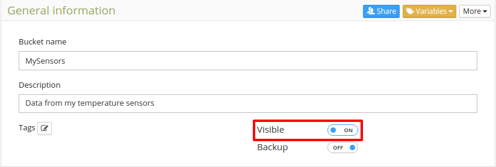

Not visible buckets can be showed back in the list by checking the box 'Show hidden buckets'.

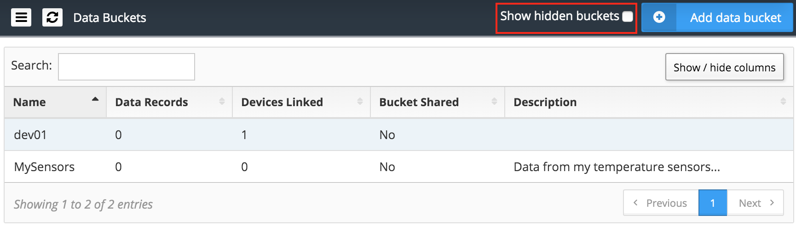

Bucket ID
=========
If you need to make a reference to a bucket, like when you want to access it from a script in the :ref:`ref_analysis_analysis`, you will need to use its bucket ID.
The bucket ID can be found under the bucket general information. The ID is unique and generated by Tago; it cannot be modified.

.. image:: _static/concepts/id_bucket.png
	:width: 70%
	:align: center

Amount of data records
======================
The amount of data stored into each bucket is also showed in the *More* section.

Variables
=========

Additional information about the variables contained in a bucket is showed under 'Variables'

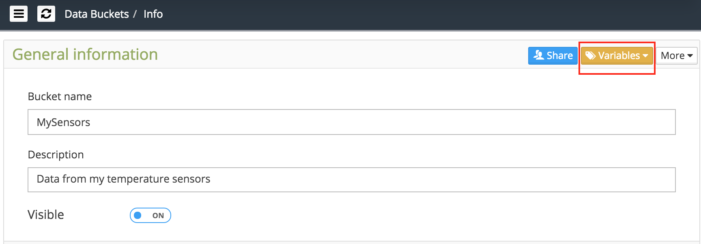

The list shows the name of the variables, the number of records and the units for each one.

Some additional features are included to manipulate the variables. Here the variables can be merged, renamed, or deleted. Just select the desired variables from the list, and click on the action to be taken.

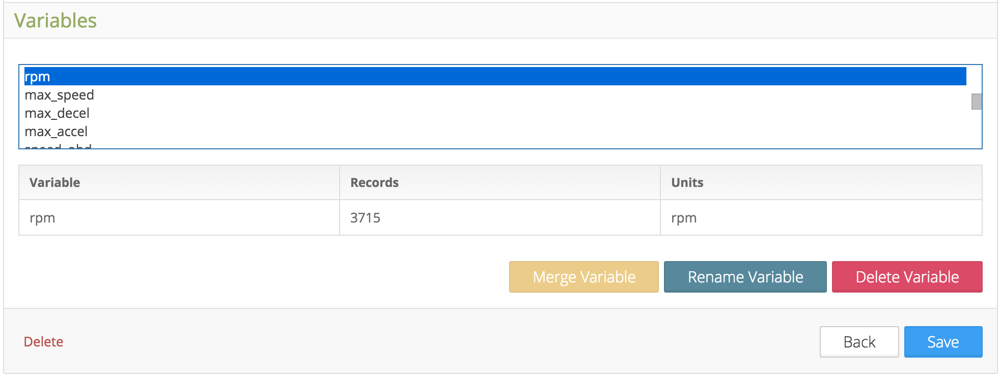

.. _ref_concepts_sharing_bucket:

Backup
======
All data sent to Tago is stored in an online database (buckets) with very fast reponse time. Through the APIs you have full access to insert, read, remove or update the data from the buckets in real-time. If you prefer, you can activate your personal backup service to create a copy of this data to an off-line database. With this option activated, Tago back-end system will automatically 
one backup for the selected bucket per day in your account. Each backup will be stored in your Tago account. The backup function is very helpful in cases when you want to activate data retention that will automatically delete old data from your account, allowing you to reduce cost by removing data that are not accessed very often. Backup storage does not count against your data record bucket storage limit, but will be counted in the backup storage (with a signficant lower cost per data register).
You may have as many buckets with backup active as you want. Note that costs may occur to perform the backup operation. This cost normally will be charged only during the preparation of the backup. Check the current terms of your plan or contact Tago directly.
It is important to be aware that the backup will not be generated all at once, and it will depend on the quantity of data and the period stored in each bucket. Just as a reference, one bucket with a 30 days records can take about one day to be completed.

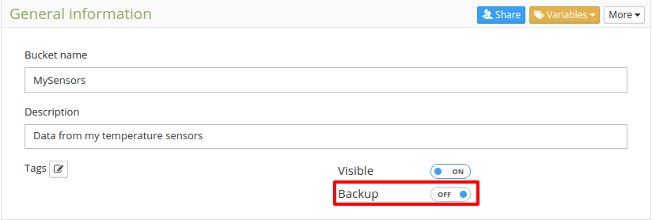

The backup process for each bucket will always run at midnight of your time zone (defined in your Account Settings). The system will create one backup file per day. Therefore, if for example you have data stored from an entire year, the system will generate 365 backup files - one for each day. 

Recover 
-------
You can easily recover the data from the backup area and move it back to the online database (bucket) by selecting the files based on the period you need. Remember that only the data contained in the buckets can be visualized at the dashboards, or processed in any way by Tago system. 

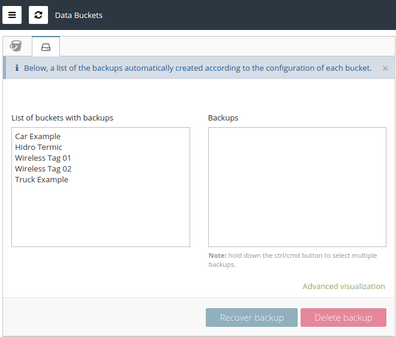

The recovered data will be backed up again at midnight (based on your time zone) and it will follow the data retention rules normally.

Data Retention
==============
We created the Data Retention feature to give the option for users to automatically remove data from the bucket after a defined period of time. The goal is to help customers to avoid unnecessary costs with data that don't need to be kept for a long period of time. By combining this feature with the Backup system, users can still keep old data by moving them to a lower cost storage system (offline that can be recovered later when necessary). Data Retention is configurable for each bucket and are disabled by default, so you need to active it every time you create a new one if you want to take advantage of the feature.

You can set the *retain data* to "Forever", it means that the data in that bucket will never be deleted automatically, or you can set to *days* or even *months*. For example, setting it to one day means that data will remain in the bucket for the time of only one day.

This system is directly linked to Backup system. If you have enabled both Backup and Data Retention in the same bucket, the Data Retention system will always wait for the last backup to be completed before it remove the data.

When a certain backup is restored, that specific data will be kept in the bucket during the period set at the Data Retention.  For example, if you recover a backup file that was created 6 months ago, and the data retention is set to 15 days, this data set will be available for 15 days e then removed again from the buckets (you can recover it again if needed).

Sharing Buckets
***************
Your data can be shared with others through the option 'Share' in the General Information session.
When the other user receives your bucket, he or she can visualize and work with your data based on the type of access that you granted.
The other user can use your data to complement his or her data analysis as long as you allow the access. You can stop sharing any time.

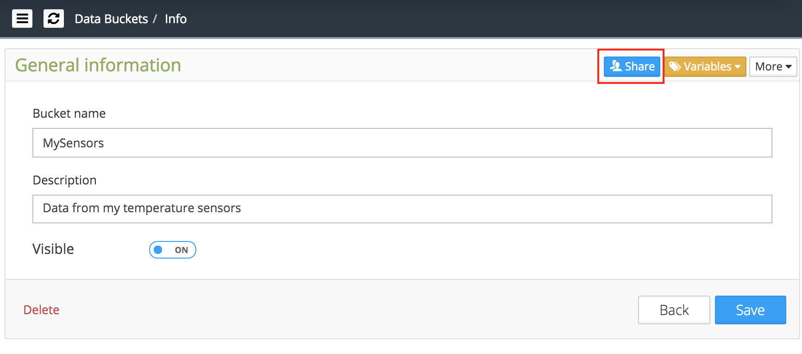

To share a bucket, simply add the e-mail of the user that will receive the access to the bucket, and define the type of access that you want to grant.

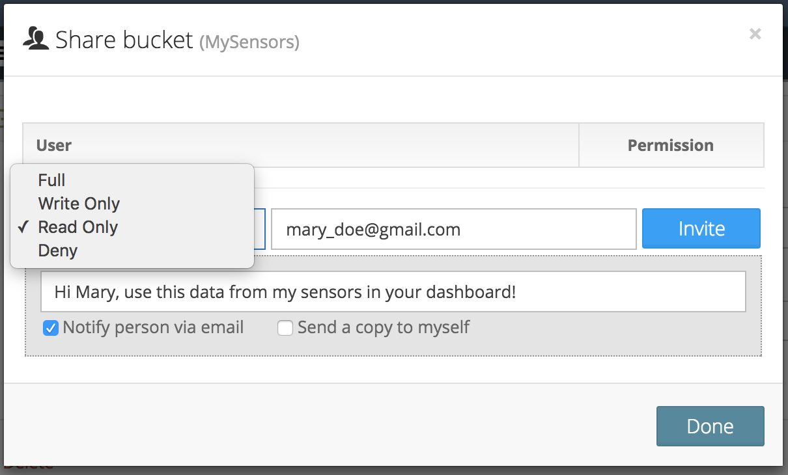

There are 4 types of access:

 | FULL - the user will be able to send and get data from the bucket

 | WRITE only - the user will only be able to **send** data

 | READ only - the user will only be able to **get** data

 | DENY - the user will have **no access** to the bucket

**Note:**
 | [1] You can only share your data, i.e., the buckets that you own. If someone shared a bucket with you, you are not able to share it with others.

 | [2] The users who received access to your bucket will not be able to delete your bucket. When they try to do so, they are in fact just removing it from their list.

.. _ref_concepts_device:

******
Device
******

*Device* is the link between your external things and the data in your account. You need to create a device in order to allow anything to send or receive data from your buckets.
The communication between the external devices and Tago is done through HTTP methods using the JSON format (HTTP in fact).
Detailed information about how to interface with the devices can be found in the :ref:`API <ref_api_api>` documentation.

Adding Devices
**************

To add a device, click on Devices on the side bar. Then, click on 'Add new device' blue button.

Enter with a name for the device and a description, and select the bucket. Again, you can edit the field later at any time.

.. raw:: html

	 <video style="max-width: 100%;" preload="none" src="_static/concepts/add_device.mp4"   controls></video>  

.. _ref_concepts_manag_device:

Managing Devices
****************

Under the **General Information** session, you can find detailed information about the device.
In your list of devices, select one to get more information, and click on MORE to obtain details.

Activated
=========

This option will define how Tago will respond to any request from the device.
If the switch is 'OFF', the system will deny access to any command coming from the device. When it is 'ON', the system will continue checking the credentials (token) and respond accordingly.

Visible
=======

With this option is possible to hide the device from the list.
It may be helpful when creating a Dashboard and using the widget :ref:`*Form*<widget-form>` that has a field type called 'Device'.
When configured with a device, the form will show the list of all visible devices connected to that bucket.

.. _ref_concepts_token:

*****
Token
*****

Device Token is the secret key used between Tago and your device. Any access request from a device will only be granted with a valid token. It doesn’t hurt to say that this token should be kept in secret and only be shared with those you trust.
Each time a device is created, the system automatically creates a token. The token information can be found by clicking on 'QR Code'.

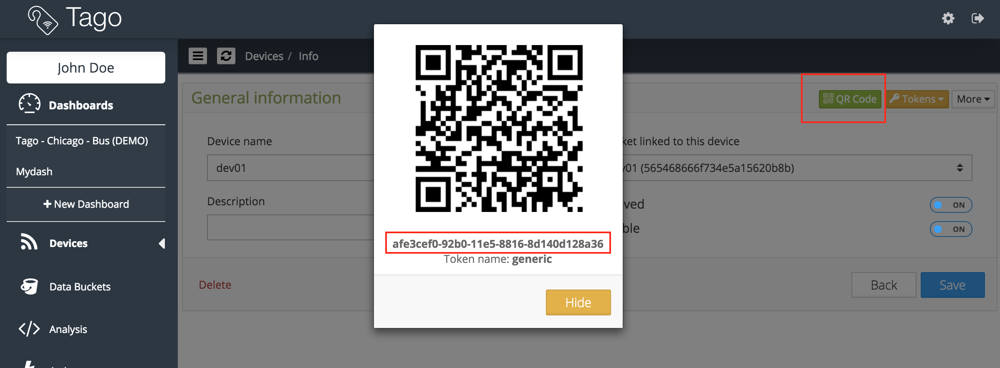

Managing Tokens
****************

Tokens can be managed by clicking on the 'Tokens' button. More than one token can be created for the same device.

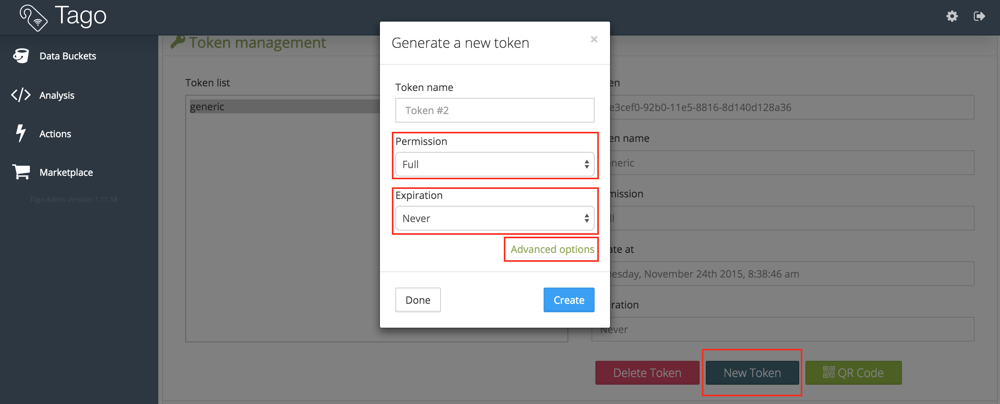

When creating a 'New Token', the following fields should be configured.

Permission
**********

 | **Full** - when using this token, the device will be able to send and receive data

 | **Write only** - the device will only be able to send data

 | **Read only** - the device will only be able to read data

Expiration
**********

This define the life of the token, which can be temporary or not (never).

Advanced Options
****************

There are two advanced options that may be requested based on the type of device. Normally, the 'Serial Number' and the 'Verification code' are only requested by a device connected to a TCP or UDP server.
Look for the setup instructions coming with the specific hardware device that you are trying to add.

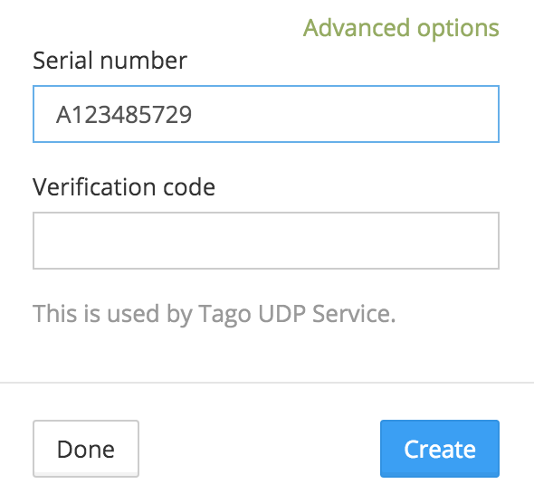

**************
Other concepts
**************

.. _concepts-serie:

Grouping variables by serie
***************************

It is expected that most devices will send more than one variable at a certain time.
And when visualizing the data, the user may want to see them synchronized at each sample period.

For example, a device sends a GPS location, speed and voltage variables at certain frequency. If they are acquired and sent with exactly the same time stamp the user can visualize the 3 variables together at each time sample.
However, if there is any delay between them (time stamps of the three variables not matching exactly), the system will not be able to group them correctly 'by time'.

That is when the field 'serie' in the JSON comes to help. A batch of acquired variables can be synced by adding the same 'serie' in their samples.  For example, the first acquisition could be:
GPS location, speed, and voltage variables all with serie = 0001, the second acquisition would have serie = 0002, and so on. When visualizing these batches of data combined in a table or map for example, just select the option 'Group by serie'.
More information about how to use this option can be found in the API, Analysis, and Dashboards documentations.

To learn how to add the 'serie' in the JSON, check out the :ref:`API <ref_api_api>` documentation.
