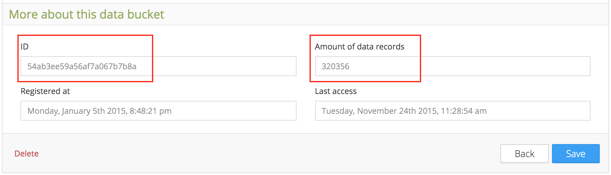

########
Concepts
########
There are few things that you need to understand about how Tago works in order to optimize your applications.
Watch this short video to learn about the bucket/device/token concepts.

.. raw:: html

	<video style="max-width: 100%;" src="_static/concepts/Tago_Tech_Concept.mp4" autobuffer controls></video>  

.. _ref_concepts_bucket:

******
Bucket
******

*Bucket* is where the data from your devices is stored. You may create as many buckets as you wish.

Bucket creation
***************

To create a bucket, click on **Data Buckets** on the sidebar. Then, click on **Add data bucket** blue button.

Enter with a name for the bucket and a short description. You can edit these fields later if needed.

.. raw:: html

	<video style="max-width: 100%;" src="_static/concepts/create_bucket.mp4" autobuffer controls></video>  

Bucket structure
****************

Each device can be connected to only one bucket. It means that the device will be filling (sending data to) only one bucket,
and that the device is able to read variables from only one bucket. To make the same variable available to different devices, it is recommended to
connect more devices in the same bucket, or use scripts in the :ref:`ref_analysis_analysis` to copy data from one bucket to another.

Note that when selecting variables in a dashboard or in a script, you will be requested to select the *bucket* and the device of *origin* that send the variable [ADD REFERENCE].
In case a bucket receives data from different devices with the same variable name, it is to separate them by defining its origin.
For example, Device01 and Device02 are sending both the variable 'temperature' to the bucket MySensors. To display the temperature from one device, just add the name of the device in the *origin* field.

If it is certain that the variable has a unique name in the bucket, or that it doesn't matter the origin of the device that send the data, you can select 'AnyDevice' in the origin field.
Doing so, when requested, Tago will return the most recent data, independently of the device that originated it.

Bucket management
*****************

Under the General Information session, you can find detailed information about the bucket.
In your list of buckets, select one to get more information, and click on MORE to obtain details.

Visible
=======

With this option is possible to hide the bucket from the list, which is helpful when you create a bucket for special proposal and don't want the final user to worry about it.
Sometimes you may want to create an hidden bucket for special scripts purposes (like a temporary bucket in the Analysis).

Not visible buckets can be showed back in the list by checking the box 'Show hidden buckets'.

Bucket ID
=========
If you need to make a reference to a bucket, like when you access it from a script in the :ref:`ref_analysis_analysis`, you will need to use the bucket ID.
The bucket ID can be found under the bucket general information. This is an unique number generated by Tago system, and it cannot be modified.

Amount of data records
======================
The amount of data stored into each bucket is also showed in the *More* session.

Variables
=========

Additional information about the variables contained in a bucket is showed under 'Variables'

The list shows the name of the variables, the number of records and the units for each one.

Some additional features are included to deal with the variables. Here the variables can be merged, renamed, or deleted. Just select the desired variables from the list, and click on the action to be taken.

.. _ref_concepts_sharing_bucket:

Sharing Buckets
***************
Your data can be shared with others through the option 'Share' in the General Information session.
When the other user receives your bucket, he or she can visualize and work with your data based on the type of access granted.
Others can use your data to complement their data analysis as long as you allow the access. You can stop sharing any time.

To share a bucket, simply add the e-mail of the user that will receive the access to the bucket, and define the type of access.

There are 4 types of access:

1. **FULL**- the user will be able to write and read data from the bucket (send and get data)

2. **WRITE only** - the user will be able to write only (only send data to the bucket)

3. **READ only** - the user will be able to read only (only get data from the bucket)

4. **DENY** - the user no longer will have any access to the bucket

**Note:**

*[1]* You can only share your data (the buckets that you own). If someone shared a bucket with you, you are not able to share it with others.

*[2]* The user who received access to your bucket will not be able to delete your bucket. When he or she tries to do so, he is in fact just removing it from his own list.

.. _ref_concepts_device:

******
Device
******

*Device* is the link between your external things and the data in your account. You need to create a device in order to allow anything to send or receive data from your buckets.
The communication between the external devices and Tago is done through HTTP methods using the JSON format.
Detailed information about how to interface with the devices can be found in the :ref:`API <ref_api_api>` documentation.

Device creation
***************

To add a device, click on Devices on the side bar. Then, click on 'Add new device' blue button.

Enter with a name for the device and a description, and select the bucket. Again, you can edit the field later at any time.

.. raw:: html

	<video style="max-width: 100%;" src="_static/concepts/add_device.mp4" autobuffer controls></video>  

Device management
*****************

Under the General Information session, you can find detailed information about the device.
In your list of devices, select one to get more information, and click on MORE to obtain details.

Actived
=======

This option will define how Tago will respond to any request from the device.
If the switch is 'OFF', the system will deny access to device. When it is 'ON', the system will continue checking the credentials (token) and respond according to the request.

Visible
=======

With this option is possible to hide the device from the list.
It may be helpful when creating a Dashboard and using the widget *Form* that has a field type called 'Device'.
When configured with a device, the form will show the list of all visible devices connected to that bucket.

.. _ref_concepts_token:

*****
Token
*****

Device Token is the secret key used between Tago and your device. Any access request from a device will only be granted with a valid token. It doesn’t hurt to say that this token should be kept in secret and only be shared with those you trust.
Each time a device is created, the system automatically creates a token. The token information can be found by clicking on 'QR Code'.

Token Management
****************

Tokens can be managed by clicking on the 'Tokens' button. More than one token can be created for the same device.

When creating a 'New Token', the following fields should be configured.

Permission
**********

1. **Full** - when using this token, the device will be able to send and receive data

2. **Write only** - the device will only be able to send data

3. **Read only** - the device will only be able to read data

Expiration
**********

This define the life of the token, which can be temporary or not (never).

Advanced Options
****************

There are two advanced options that may be requested based on the type of device. Normally, the 'Serial Number' and the 'Verification code' are only requested by a device connected to a TCP or UDP server.
Look for the setup instructions coming with the specific hardware device that you are trying to add.

**************
Other concepts
**************

.. _concepts-serie:

Grouping variables by serie
***************************

It is expected that most devices will send more than one variable at a certain time. And when visualizing the data, the user may want to see them synchronized at each sample period. For example, a device sends a GPS location, speed and voltage variables at certain frequency. If they are acquired and sent with exactly the same time stamp the user can visualize the 3 variables together at each time sample.
However, if there is any delay between them (time stamps of the three variables not matching exactly), the system will not be able to group them correctly 'by time'.

That is when the field 'serie' in the JSON comes to help. A batch of acquired variables can be synced by adding the same 'serie' in their samples.  For example, the first acquisition could be:
GPS location, speed, and voltage variables all with serie = 0001, the second acquisition would have serie = 0002, and so on. When visualizing these batches of data combined in a table or map for example, just select the option 'Group by serie'.
More information about how to use this option can be found in the API, Analysis, and Dashboards documentations.
