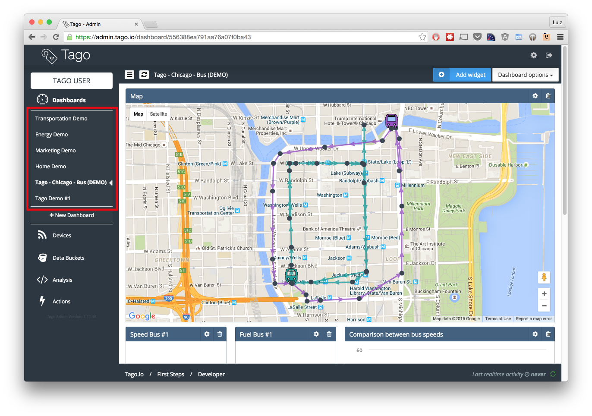
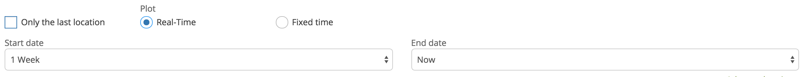
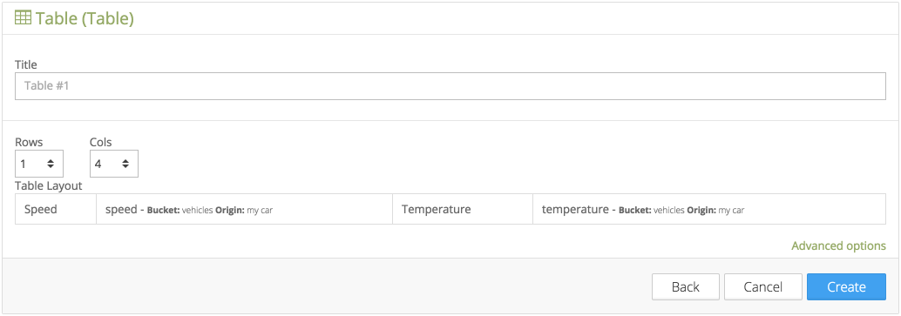

.. _ref_dashboard_dashboard:

#########
Dashboard
#########

A dashboard is where you place your widgets to visualize and interact with data, everything in real time. All your dashboards are listed on the sidebar of Tago. On the top right you will find the **Dashboard options** menu. From there you will have access to other dashboard functionalities such as **rename**, **share** and **delete**.

You can organize them in the way that best fit your needs by moving and resizing your widgets.

.. raw:: html

	 <video style="max-width: 100%;" preload="none" src="_static/dashboard/dashboard_1.mp4"   controls></video>  

*******************
Building dashboards
*******************

To create a new dashboard, just click the button below your dashboards list **+ New Dashboard**, give a name to your new dashboard and click on **Create**.

.. raw:: html

	 <video style="max-width: 100%;" preload="none" src="_static/dashboard/dashboard_create.mp4"   controls></video>  

Widgets
*******

Dashboards are made of widgets. Tago provides a variety of widgets to handle your data in real time. From simple **dials** to **tables**, **maps** and even **forms** that you can use to create new data.

.. image:: _static/dashboard/widget_types.png

.. _widget-data:

Variables
*********

As most widgets handle data, they need a data source. The data source of your widgets are the variables created when you send data from your device to Tago's API. So you have to pick which variables, from which device & bucket, to use as data in your widgets.

You'll notice that many widgets uses your variables name in order to identify, for example, a line of a chart or a device in a map. And we know that sometimes your variable name isn't appropriate to the end user. Because of that, every variable selected might have a **label**. A label is simply an alias that will be used by the widget whenever it needs to display your variable name. To add an alias to a variable, just click on top of it, and you'll see a little balloon with the alias field.

Along with the alias field, you'll see that you can change the bucket and/or the device of this variable. Well, sometimes our needs changes or a new device is now responsible for sending an specific data. Whatever the reason, you're covered. You can change your variable settings if you need.

.. _widget-config:

Configuration
*************

Besides the data sources, every kind of widget has its own particular configurations in regard to how to display the data. So when creating a widget, you're going to find **basic** options - generally these are critical to the algorithm that builds your widget - and **advanced** options, which allows you to give your personal touch to each widget and also provides advanced features you might need. Two advanced features included in every widget are:

* Help text
* Hide variables name

The **help text** allows you to add a little help text that will be placed on the top-right corner of your widget, under a interrogation sign.

The second one gives you the ability of hiding the variables name in the widget. It can be useful if you don't want to show names at all in your widgets. We recommend you to add a descriptive title in such cases though.

You will notice that some widgets are more complex than others. While a dial only need a mininum and maximum value, a **multiple axis chart** needs more configuration related to each variable, in this particular case you'll have to define the type (bar, line, etc) of each data source. This kind of customization, while it takes a little more time to get done, offers you a lot of flexibility.

.. _widget-time:

Time
****

When creating your widgets, you are going to see that some of them works only showing the latest value added of your variable and keeps it updated through real time updates. Others can exhibit a range of time while keeping it updated through real time updates, and some widgets just show some data in a particular period of time. When more than one of the previous options is available in a widget, its up to you to choose the best one that fits your needs. These options may be like the following:

* Only the last value
* Realtime
* Fixed time

And don't worry, because you'll find an option under **Advanced Options** to choose in which time zone that time will be related to.

Dial
****

Dials are one of the simplest and useful widgets. They make easy to visualize how far/near a value is in between a range.

Its configuration is very simple. You can pick as many :ref:`variables <widget-data>` as you need, each one of them will have its own dial chart inside a single widget. We set the default minimum and maximum values of the range to 0 and 100 for your convenience, but you can easily change it.

Advanced Options
================

In the advanced options you will see an option to change de format of the number to be show in regard to the number of decimal places.

You will also see an option to set the unit of your value. You must be aware that even if your data contains a ``unit`` property, it will be overridden by this setting.

Display
*******

As the name says, this is a widget that displays the last value of its :ref:`variables <widget-data>`, regardless of the type (text or number) of the value. You can pick as many :ref:`variables <widget-data>` as you want, each one of them will have its own box and the values will be shown simultaneously.

Advanced Options
================

This widget only have general advanced options, as mentioned earlier in the :ref:`configuration section<widget-config>`.

Line / Area / Bar charts
************************

Charts are a very powerful way of visualizing your data and have insights. At Tago you'll find a variety of charts to use.

Easy to configure, these charts only need you to pick some :ref:`variables <widget-data>` and to choose which :ref:`time <widget-time>` settings to use.

Advanced Options
================

Under the **advanced options**, you'll find the :ref:`timezone <widget-time>` selector and a few specific options:

**Maximum number of points to be displayed**: this option will help you to filter exactly the amount of data you need, while it still keeps showing the most recent ones.

**Stack graphics**: this option determines whether to stack the values of each series on top of each other.

**Show device name associated with each variable**: this option tell the chart to show the device name near the variable name. It's useful when you have variables with the same name in the chart.

Multiple Axis charts
********************

This kind of chart allows you to plot your data using bars, lines, columns and areas in the same chart. Which is why you have to set the type of your chart for each variable you add. Besides that, you will also have to choose which :ref:`time <widget-time>` settings to use.

Advanced Options
================

Under the **advanced options**, you'll find the :ref:`timezone <widget-time>` selector and a few specific options:

**Maximum number of points to be displayed**: this option will help you to filter exactly the amount of data you need, while it still keeps showing the most recent ones.

**Group the samples by**: by default, the X axis of the chart will be the time of the values. But, sometimes you need to group your data through the X axis even if they don't have the exactly same time, in that cases you must make use of a :ref:`serie <concepts-serie>`.

**Stack graphics**: this option determines whether to stack the values of each series on top of each other.

**Show device name associated with each variable**: this option tell the chart to show the device name near the variable name. It's useful when you have variables with the same name in the chart.

Map
***

If your data have location information [#f1]_ about the device of origin attached, you can visualize it in a map. This is easy as choosing one or more :ref:`variables <widget-data>` and selecting which :ref:`time filters<widget-time>` to use.

As you pick variables for your map, you'll have two more options to fill about its device of origin:

**Icon**: choose an icon and color to represent that device on the map.

**Label**: give that device an alias to be shown inside the information window. This is useful to differentiate devices with the same icon and color on the map.

.. rubric:: Notes:

.. [#f1] If you don't know how to send location coordinates within your data, please read our :ref:`API docs<ref_api_api>`

Advanced Options
================

Under the **advanced options**, you'll find the :ref:`timezone <widget-time>` selector and a few specific options:

**Connect markers with lines**: this option makes every point of the same device to be connected through a line, as a route.

**Ignore heading direction from variable**: if checked, the `heading` property of your location data will be ignoring during the build of the map. So, instead of having an arrow pointing exactly to your heading direction in each point of your route, you'll have automatically generated arrows placed all over your route.

**Do not open info windows automatically**: if checked, the window with the data values won't automatically open when the widget is shown or when new points are plotted in real time.

**Show icons for all values**: this option will make the device icon appear for every point of his route in the map.

**Do not display (0, 0) coordinates**: sometimes GPS devices send locations with latitude 0 and longitude 0 by mistake, affecting the routes on your map. Check this option if you are having this kind of problem.

**Maximum number of points to be displayed**: this option will help you to filter exactly the amount of data you need, while it still keeps the mostly recent.

**Group the samples by**: sometimes only one of your variables has the location information, but there are other variables related to it that you would like to display together on the map, in this case you must make use of a :ref:`serie <concepts-serie>`. Otherwise it will be grouped using the ``time`` and ``location`` of each data.

Table
*****

Table widgets presents your data in a tabular way. It is one of the special kinds of widgets. Unlike the others, you won't find the traditional variable selector, initially there's only two fields to fill: the number of **rows** and **columns**. After selecting these two values, you'll have a scheme of how the table is going to look like with all your rows and cells.

To finish, you just need to fill your cells either with text or with the value of a variable. To do that, click on a cell, select the type and fill the value (a text or a variable).

Cells with variables will always display the last value of the variable and it will be updated in real time as soon as a new value arrive.

Color Options 
=============
You are able to define colors for the cell where a variable is displayed. By default, the background is transparent (white). If you use metadata when posting a variable, you are able to define the background color of that specific cell. For example, by adding metadata to this POST in JSON below, the cell that shows the variable 'temperature' will change its color to 'green'. 

.. code-block:: javascript
  {
      "variable" : "temperature",
      "value": "71",
      "unit"  :"F",
      "metadata": {"color":"green"}
  }
  
  As the color should be associate with the data of a variable, it is not possible to color cells that are selected as type 'Text'  (option available in each cell input used during the configuration).
  Use the metadata color options from your Analysis to help your users to detect issues or alerts on a table more easily.
  
Dynamic Table
*************

Dynamic tables, as the name says, are tables generated dynamically using you data. Its configuration is easy, just pick your :ref:`variables<widget-data>`, choose a time span and you are ready to go. Make sure that the data you want to display in the table is grouped using a :ref:`serie number<concepts-serie>`, otherwise the values will appear each one in its own rows, with all the other cells left in blank.

Each one of the variables you selected will become a column and the rows will contain the values, from the most recent to the oldest data. As soon as new values of the selected variables arrives, they are added to the table.

By default the column title will be the variable name, but you can change it by adding a label to your variables.

Advanced options
================

Under **advanced options** you will find some specific options:

**Maximum number of rows**: if the time span isn't enough, you can also filter the exactly amount of data that will appear in your table using this option.

**Only display rows with all values**: this option guarantees that only rows with values in all of its cells will appear.

**Display date and time**: if you check this options, a column named "Time" will be added to the table and will show the ``time`` of one of the values of that row.

Pie
***

Not available yet.

Control input
**************

Not available yet.

.. _widget-form:

Form input
***********

The form input is a powerful widget among the others that Tago offers. It allows you to build complex forms to create new data.

For this widget, select the :ref:`variables<widget-data>` that will hold the values sent through the form, each one of them will have its own field in the form so you can set a value. Every time you submit the form widget, the values set in each field will be created in the API using the variables of each field. They will also be grouped together through a :ref:`serie number<concepts-serie>`, so you can use them grouped in maps, dynamic tables, charts, etc.

There are a variety of field types that you can use:

Checkbox
	A traditional checkbox will appear and the value will be set as true (checked) or false (not checked).

Radio
	A traditional radio input will appear. Once selected you will be able to define its options with their labels and values. The value of the field will be the one of the selected option.

Text
	A typical text input will appear and the value will be anything that was typed into it.

Dropdown
	It displays a dropdown menu with options that you define. The value of the field will be the one of the selected option.

Hidden
	Unlike the others, this field type doesn't display anything on the form. It will be there as an invisible field and you won't be able to change its value unless you edit this widget.

Address
	It will display a text field integrated with Google Maps to look for an address. The value for this field will be the complete address selected and it will also have the location coordinates within it.

Device
	It will display a dropdown menu in which options will be your devices. The value of the field will be the id of the selected device.

Validation
	This field is the only one that doesn't represent a value to be sent with the form. The variable set to this field type expect to receive data (text) to show as a message above the form. Besides the text, you can also define the type of message that will appear. There are four types: *warning*, *info*, *danger* and *success*. You do this by sending a property ``type`` in the metadata [#metadata]_ object of your data.

.. rubric:: Notes

.. [#metadata] If you don't know about the metadata object, read our :ref:`API docs<ref_api_api>`

Advanced options
================

Under **advanced options** you will find some specific options:

**Display a "Clear" button to reset fields**: this option makes a "Reset" button in the end of the form. When clicked, all fields will return to its **default values**.

**Confirm before submit**: this option will make a confirmation window appear everytime you try to submit the form.

**Display a map to visualize address**: this option will display a map at the end of the form, and this map will display the last address selected in a address field.

Gauge
*****

Not available yet.

Note
****

Not available yet.

.. _dashboard_share_dashboards:

******************
Sharing dashboards
******************

Sometimes a dashboard can become an entire feature that you want to share. Now there are two ways of sending a dashboard to someone:

* :ref:`dashboard-share`
* :ref:`dashboard-clone`

.. _dashboard-share:

Share
*****

When you share your dashboard, others can only visualize it. They will not be able to move, resize, or even edit widgets. They will also have access only to the variables that you added on it.

To **share** a dashboard with someone, you must access that dashboard and then, through the **Dashboard options** menu, click in **Share**.

.. raw:: html

	 <video style="max-width: 100%;" preload="none" src="_static/dashboard/dashboard_share_1.mp4"   controls></video>  

To complete the action, fill the email of whom you want to share your dashboard. Then optionally write him/her a message.

.. raw:: html

	 <video style="max-width: 100%;" preload="none" src="_static/dashboard/dashboard_share_2.mp4"   controls></video>  

In that screen you can also visualize the list of people which you already shared that dashboard. From there, you can also stop sharing your dashboard by clicking the trash can.

.. raw:: html

	 <video style="max-width: 100%;" preload="none" src="_static/dashboard/dashboard_share_3.mp4"   controls></video>  

.. _dashboard-clone:

Clone
*****

When you create a clone of your dashboard, others will only receive the dashboard without having any access to your data. They are able to edit the dashboard and its widgets without impacting yours.

To **clone** a dashboard and send it to someone, you must access that dashboard and then, trough the **Dashboard options** menu, click in **Share**.

.. raw:: html

	 <video style="max-width: 100%;" preload="none" src="_static/dashboard/dashboard_copy_1.mp4"   controls></video>  

To complete the action, fill the email of whom you want to copy your dashboard to, optionally write him/her a message and then describe the type of devices that are needed for that dashboard. (we automatically gather the devices used by your dashboard and show you just what you need to describe)

.. raw:: html

	 <video style="max-width: 100%;" preload="none" src="_static/dashboard/dashboard_copy_2.mp4"   controls></video>  

*******************
Renaming dashboards
*******************

