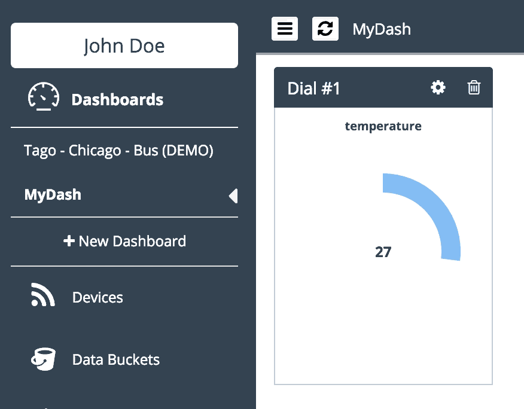

###############
Getting Started
###############
Here is how to get started with Tago.

Log in to `www.tago.io <https://tago.io/>`_. If you haven't created an account yet, signup for free now.

********************
Step 1. Add a device
********************
Start by adding a  :ref:`device <ref_concepts_device>` to your account. This will provide a link between the data in your account and the external world.

In this example, let's send a variable called *temperature* from your device to your account at Tago.

On the left side bar, click on **Devices**. Then, click on **Add Device** (the top right button), enter with the name of the device, for this example: 'dev01', and click on 'Save'.

For each device, you have to define a :ref:`bucket <ref_concepts_bucket>` to store its data. You can let Tago create a new bucket with the same name as the device.

For security, all devices should use a valid :ref:`token <ref_concepts_token>` when accessing Tago. One token is automatically generated when a device is created.
Later in this example, you will need to use this token. Go to the 'General information' section of the device, click on 'QR Code' or 'Tokens' and copy the token code that was created for your device.

This video shows how to take the steps above in a few seconds.

.. raw:: html

	 <video style="max-width: 100%;" preload="none" src="_static/getstarted/add_device.mp4"   controls></video>  

*************************
Step 2. Build a dashboard
*************************

You can build great :ref:`dashboards <ref_dashboard_dashboard>` to visualize data, interact with your devices and share with others. You can build it with the widgets that best fit your needs.

Click '+ New Dashboard' on the left side bar, type the name of your dashboard, and click on 'Create'.

Let's add one widget to show the variable *temperature*. Click on 'Add Widget' (the top right button), and pick the widget *Dial*.

Start the configuration of this widget by adding the variable to be displayed.
Type the variable name that will be sent by the device as 'temperature', then click on 'add' below the name. Select your bucket [dev01], your device [dev01], and click 'OK'.
Then, click 'Create', and your widget will be ready!

 .. raw:: html

 	 <video style="max-width: 100%;" preload="none" src="_static/getstarted/add_var_dash.mp4"   controls></video>  

 | *Note: if the variable 'temperature' already exists in your data bucket, the auto-complete function will immediately bring it for you.*

As soon as your device starts to send data, the values will be showed on this dial.

*****************
Step 3. Send data
*****************

Now that you completed the setup of your account, you are ready to send data from your electronic devices using our :ref:`APIs <ref_api_api>`. You can use one of our :ref:`SDKs <ref_sdk_sdk>` designed for your platform.

Or you can simulate your device right now, by sending data remotely to your bucket by using any tool that transfers data from and to a server with HTTP.
Below, you will learn how to quickly send data depending on the OS that you are using.

Mac or Linux Command Line
**************************

Let's use **cURL** to post the data.
Enter with the following command replacing the *YOUR_TOKEN_HERE* by that **token** created earlier for your device.

.. code-block:: text

 curl -H "Content-Type: application/json" -H "Device-Token: 6ea148d0-e75c-11e6-a091-5756b91044c4" -X POST -d '{"variable":"temperature","value":27,"unit":"F"}' https://api.tago.io/data

Try to send more data by changing the value of the 'temperature'. Keep an eye on your dashboard. You should see something like this.

Windows
*******
To send data, there are some tools that support HTTP communication like the `Postman <https://www.getpostman.com/>`_. Considering the same input as used above, you can make a POST by entering the url, Device-Token, and configuration in the **Postman** like this:

.. image:: _static/getstarted/postman1.png
		:height: 300
		:width: 600

Then, input the variable information in the JSON body. Make sure that you select the same configuration as showed in the picture below.

.. image:: _static/getstarted/postman2.png
				:height: 300
				:width: 600

The response should looks like this.

.. image:: _static/getstarted/postman3.png
		:height: 300
		:width: 600

***********************
Step 4. Explore Tago.io
***********************

This is just the beginning! Check out how powerful the Tago platform is to create prototypes and deploy them to production.

Learn how to :ref:`share dash boards <dashboard_share_dashboards>` and :ref:`data buckets <ref_concepts_sharing_bucket>`.

Create powerful :ref:`data analysis <ref_analysis_analysis>` in realtime using our script capabilities in Java Script. Program :ref:`actions <ref_actions_actions>` to be taken based on your rules.

Learn more about our powerful :ref:`API's <ref_api_api>`. And check out the :ref:`tutorials <ref_tutorial_intro>` and :ref:`SDKs <ref_sdk_sdk>` prepared for different boards and applications.

Visit our Marketplace! You will find dashboards ready to be used in interesting applications.
