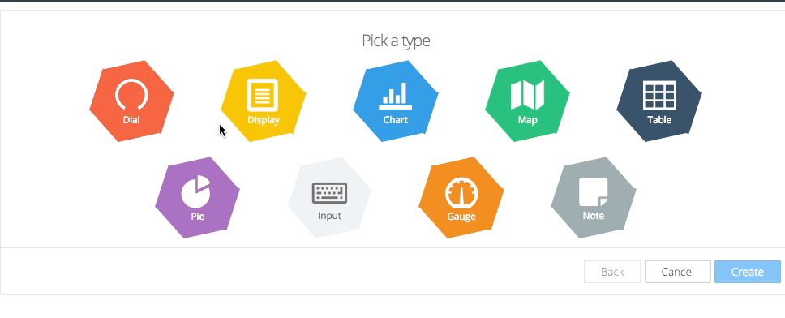

Getting Started
***************
Here is how to get started with Tago.io

Log in to Tago.io. If you haven't created an account yet, register for free now.

Step 1. Add a device
-----------------------
First, you need to add a **device** to your account. This will enable a link between your data and the external world. In this example, let's send a room temperature data from your device.

Go to the admin session in your account,  click on **Devices** on the left side bar. Then, click on **Add Device** blue button, enter with the name 'dev01' and click on 'Save'.

.. raw:: html

	
For each device, you have the option to define a **bucket** that will store its data. You can pick a bucket with the same name as the device.

For security, all devices should use a valid token when accessing Tago. One token is automatically generated when a device is created.
Later in this example, you will need this token. Go to the 'General information' session of the device, click on 'QR Code' or 'Tokens' and copy the token code that was created for your device.

.. raw:: html

	

Step 2. Build a dashboard
--------------------------
You can build great dashboards to visualize data, interact with your devices and share them with other users. You can pick the widgets that best fit your needs.

Click on '+ New Dashboard' on the left side bar, type the name of your dash board, and click on 'Create'.

.. raw:: html

	
mostra tela create dashboard (adding name)

For this example, let's add one widget to show the room temperature. Click on 'Add Widget' blue bottom and pick the Dial widget.

.. image:: widgets1.png
	:height: 200
	:width: 400

To configure this widget, first you need to add a variable. Type the variable name that will be sent by the device as 'temperature_1', click on 'add' below the name. Select your Bucket (dev01) and the device (dev01), click on 'OK'.
Then, click on 'Create', and your widget is ready!

As you don't have any data yet, you should see something like this.

Step 3. Send/Get data
---------------------
Now you are ready to integrate Tago system with your electronic devices or apps. You can use one of our **SDK's** for your platform.
By now, to simulate your device, lets exchange data remotely with the bucket in your account by using **curl** (or **blabla** if you are using Windows).
We will need to use the device **token** created in the earlier step.

.. raw:: html

	

Try to send more data by changing the value of the 'temperature_1' variable. Keep the eye on your dashboard. You should see something like this.

...........ADD GIF Dial moving!!

Step 4. Explore Tago.io
----------------------------------
This is just the beginning! Check out what else you can do with Tago.io.

It is very easy to get data, and share your *dashboard* and *buckets*.

Check external sources of data to combine it with your own data set.

Create powerful realtime analysis using our script capabilities in Java Script. Take actions based on your rules.

Visit our Marketplace. You will find dashboards ready for use in different applications.
