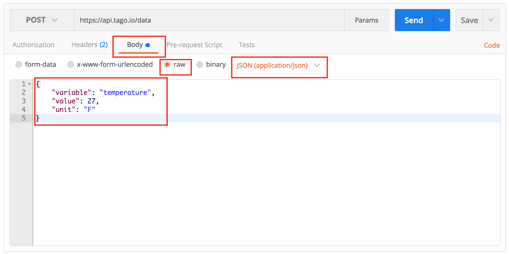

###############
Getting Started
###############
Here is how to get started with Tago.io

Log in to Tago.io. If you haven't created an account yet, signup for free now.

********************
Step 1. Add a device
********************
You can start by adding a  :ref:`device <ref_concepts_device>` to your account. This will enable a link between your data and the external world. In this example, let's send a variable called *temperature* from your device.

On the left side bar, click on **Devices**. Then, click on **Add Device** blue button, enter with the name 'dev01' and click on 'Save'.

For each device, you have to define a :ref:`bucket <ref_concepts_bucket>` to store its data. You can let Tago to create a new bucket with the same name as the device.

For security, all devices should use a valid :ref:`token <ref_concepts_token>` when accessing Tago. One token is automatically generated when a device is created.
Later in this example, you will need this token. Go to the 'General information' session of the device, click on 'QR Code' or 'Tokens' and copy the token code that was created for your device.

.. raw:: html

	<video style="max-width: 100%;" src="_static/getstarted/add_device.mp4" autobuffer controls></video>  

*************************
Step 2. Build a dashboard
*************************

You can build great :ref:`dashboards <ref_dashboard_dashboard>` to visualize data, interact with your devices and share with others. You can pick the widgets that best fit your needs.

Click '+ New Dashboard' on the left side bar, type the name of your dashboard, and click on 'Create'.

Let's add one widget to show the variable *temperature*. Click on 'Add Widget' blue bottom and pick the widget *Dial*.

To configure this widget, first you need to add a variable to be displayed.
Type the variable name that will be sent by the device as 'temperature', click on 'add' below the name.
Select your bucket [dev01], your device [dev01], click on 'OK'.
Then, click on 'Create', and your widget is ready!

.. image:: _static/getstarted/variable_input.gif
	:height: 300
	:width: 600
		:align: center

Good! As soon as your device start to send data, the values will be showed on this dial.

*****************
Step 3. Send data
*****************

Now you are ready to integrate Tago system with your electronic devices or apps. You can use one of our :ref:`SDKs <ref_sdk_sdk>` designed for your platform.
Or we can simulate your device, by exchanging data remotely with your bucket using **curl** in a **Mac** or **Linux**.
Here, you will need to use that **token** created earlier for your device.

.. raw:: html

	

Try to send more data by changing the value of the 'temperature' variable. Keep an eye on your dashboard. You should see something like this.

add GIF here !!! ////

If you are using **Windows**, you can send data with Postman (https://www.getpostman.com/). Considering the same inputs as above, you will can make a POST using the url, Device-Token in the Postman like this:

Then, input the variable information in the JSON body. Make sure you select the same configuration as showed in the picture below.

The response should looks like this.

.. image:: _static/getstarted/postman3.png
		:height: 300
		:width: 600

***********************
Step 4. Explore Tago.io
***********************

This is just the beginning! Check out how powerful the Tago platform is.

Learn how to :ref:`share dash boards <dashboard_share_dashboards>` and :ref:`data buckets <ref_concepts_sharing_bucket>`.

Create powerful :ref:`data analysis <ref_analysis_analysis>` in realtime using our script capabilities in Java Script. Program :ref:`actions <ref_actions_actions>` to be taken based on your rules.

Learn more about our powerful :ref:`API's <ref_api_api>`. And check out the :ref:`tutorials <ref_tutorial_intro>` and :ref:`SDKs <ref_sdk_sdk>` prepared for different boards and applications.

Visit our Marketplace! [beta] You will find dashboards ready to be used in interesting applications.
