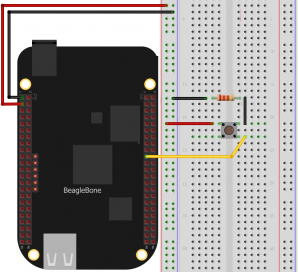

.. _ref_tutorial_intro:

#########
Tutorials
#########

*******
Arduino
*******

.. image:: _static/tutorials/arduinozero_wifi101.png
	:width: 70%
	:align: center

This is a quick example using **Arduino Zero** to send data to Tago.
For the connectivity board, we selected the shield **Atmel WiFi101**.
To learn about the Arduino Zero and how to get started, click `here. <https://www.arduino.cc/en/Guide/ArduinoZero>`_

In this example, let's send the temperature reading from the Arduino to Tago. We will visualize the temperature in the dashboard, and use
the actions capability to send e-mails when the temperature reaches a threshold.

Diagram
*******
The temperature sensor used in this tutorial is the TMP36 that comes in a TO-92 package. The output of the TMP36 is a voltage that will be read by the Analog pin 0 of the Arduino Zero. As the Arduino Zero is a 3.3V board, we will use the following formula to convert the reading to temperature in Celsius.

**Voltage at pin in milliVolts = (reading from ADC) * (3300/1024)**

This formula converts the number 0-1023 from the ADC into 0-3300mV (= 3.3V)

Then, to convert millivolts into temperature, use this formula:

**Centigrade temperature = [(analog voltage in mV) - 500] / 10**

.. image:: _static/tutorials/arduino_tmp36.gif
	:width: 70%
	:align: center

Adding the Device
*****************

Log in your account, click on Devices (side bar), then click on 'Add Device' blue button.
The Arduino board will be the device to be added, we will give it the name 'dev01'. Therefore, enter with the name 'dev01' and click on 'Save'.

For each device, you have to define a :ref:`bucket <ref_concepts_bucket>` to store its data. You can let Tago to create a new bucket with the same name as the device.

All devices should use a valid :ref:`token <ref_concepts_token>` when accessing Tago. This token is automatically generated when a device is created.
Go to the 'General information' session of the device, click on 'QR Code' or 'Tokens' and copy the token to be added in the Arduino code later.

.. raw:: html

	 <video style="max-width: 100%;" preload="none" src="_static/getstarted/add_device.mp4" controls></video>  

Building the Dashboard
**********************

Let's build a simple :ref:`dashboard <ref_dashboard_dashboard>` to visualize the data sent by your Arduino. Click '+ New Dashboard' on the left side bar, type the name of your dashboard, and click on 'Create'.
Let's add one widget to show the variable *temperature*. Click on 'Add Widget' blue bottom and pick the widget *Dial*.

Start the configuration of this widget by adding the variable to be displayed.
Type the variable name that will be sent by the device as 'temperature', click on 'add' below the name. Select your bucket [dev01], your device [dev01], and click 'OK'.
Then, click 'Create', and your widget will be ready!

.. raw:: html

	 <video style="max-width: 100%;" preload="none" src="_static/tutorials/add_var_dash.mp4" controls></video>  

Great! As soon as your device start to send data, the values will be showed on this dial.

Sending e-mail
**************

Now, let's add an :ref:`action <ref_actions_define_actions>` to send an e-mail notification when the sensor overheat.
First, create an action for the device:

.. image:: _static/tutorials/create_actions.png
	:width: 80%
	:align: center

.. image:: _static/tutorials/action_name.png
	:width: 50%
	:align: center

Configure the action to send the e-mail, enter with the destination e-mail address in the 'To' field, and the Subject. Tago can include dynamic variables in the body of the message! For example, using $VALUE$ in the message, we can send the last temperature value with the text.
An e-mail body written as: ``Hi, the temperature is $VALUE$``, could in fact send an e-mail like: ``Hi, the temperature is 26.5``

.. image:: _static/tutorials/action_defined.png
	:width: 70%
	:align: center

To make sure that you will receive only one notification each time the temperature passes the threshold, we will define values to **Set** and **Reset** the trigger. It will create a hysteresis function to prevent the system from sending e-mails continuously.
Basically, we just need to configure Set Trigger and Reset Trigger as showed below.
You can change the threshold values later, by now, let's send an e-mail when the temperature goes over 50C and reset the trigger when it goes back to less than 30C.

.. image:: _static/tutorials/trigger_set.png
	:width: 70%
	:align: center

Sending data from Arduino
*************************

Your setup is ready at Tago! Now, you just need to code your Arduino to send the data to Tago.

When communicating with devices, Tago uses the JSON format. For example, to send a temperature value of 26 C, the device just needs to POST the data:

.. code-block:: json

	{
	    "variable": "temperature",
	    "value": 26,
	    "unit": "C"
	}

Here for the Arduino, we give a C code example which use HTTP format connecting through port 80 (non-secure) to simplify the example. To send the data, the json data will result in code with a post as simple like: "variable":temperature, "value":26,"unit":"C".

Arduino Code
============

.. code-block:: c

	/*
	  Send data to Tago - Wifi101

	 This sketch connects to the TAGO server and post a data
	 using an Arduino Wifi 101 shield.

	 Circuit:
	 * WiFi shield attached to pins SPI pins and pin 7

	 Based on the the Wifi Web Client from
	 http://arduino.cc/en/Tutorial/WifiWebClientRepeating.
	 */

	#include <SPI.h>
	#include <WiFi101.h>

	char ssid[] = "## YOUR NETWORK HERE ##";      //  your network SSID (name)
	char pass[] = "## YOUR NETWORK PASSWORD HERE ##";   // your network password
	String Device_Token = "## INSERT THE TOKEN FOR YOUR DEVICE HERE ##";

	
int keyIndex = 0;         // your network key Index number (needed only for WEP)

int sensorPin = A0;       // select the input pin for the analog input
int rawvoltage = 0;       // variable to store the value coming from the sensor
float sensorValue = 0;
String value_string = ""; 

int status = WL_IDLE_STATUS;

// Initialize the Wifi client library
WiFiClient client;

// server address:
char server[] = "api.tago.io";

unsigned long lastConnectionTime = 0;            // last time you connected to the server, in milliseconds
const unsigned long postingInterval = 2L * 1000L; // delay between updates, in milliseconds

void setup() {
  //Initialize serial and wait for port to open:
  Serial.begin(9600);
  while (!Serial) {
    ;                     // wait for serial port to connect. Needed for native USB port only
  }

  // check for the presence of the shield:
  if (WiFi.status() == WL_NO_SHIELD) {
    Serial.println("WiFi shield not present");
    // don't continue:
    while (true);
  }

  // attempt to connect to Wifi network:
  while ( status != WL_CONNECTED) {
    Serial.print("Attempting to connect to SSID: ");
    Serial.println(ssid);
    // Connect to WPA/WPA2 network. Change this line if using open or WEP network:
    status = WiFi.begin(ssid, pass);

    // wait 10 seconds for connection:
    delay(10000);
  }
  // you're connected now, so print out the status:
  printWifiStatus();
}

void loop() {
  // if there's incoming data from the net connection.
  // send it out the serial port.  This is for debugging
  // purposes only:
  while (client.available()) {
    char c = client.read();
    Serial.write(c);
  }

  // if TWO seconds have passed since your last connection,
  // then connect again and send data:

  if (millis() - lastConnectionTime > postingInterval) {
    // read the value from the sensor:
    rawvoltage = analogRead(sensorPin);
    // converting that reading to voltage, for 3.3v voltage 
    float voltage = rawvoltage * 3.3;
    voltage /= 1024.0;    
    // converting to Celsius
    float temperatureC = (voltage - 0.5) * 100 ;  //converting from 10 mv per degree wit 500 mV offset
                                                  //to degrees ((voltage - 500mV) times 100)                                                      

    int i = (int) temperatureC;                   //convert data format from float to int
    value_string =String(i);                      //end of conversion, to finally get it in the String format (Celsius)
    Serial.println(value_string);

    // then, send data to Tago
    httpRequest();
  }

}

// this method makes a HTTP connection to the server:
void httpRequest() {
    // close any connection before send a new request.
    // This will free the socket on the WiFi shield
    client.stop();

    Serial.println("\nStarting connection to server...");
    // if you get a connection, report back via serial:
    String PostData = String("{\"variable\":\"temperature\", \"value\":") + String(value_string)+ String(",\"unit\":\"C\"}");         
    String Dev_token = String("Device-Token: ")+ String(Device_Token);
    if (client.connect(server,80)) {                      // we will use non-secured connnection (HTTP) for tests
    Serial.println("connected to server");
    // Make a HTTP request:
    client.println("POST /data? HTTP/1.1");
    client.println("Host: api.tago.io");
    client.println("_ssl: false");                        // for non-secured connection, use this option "_ssl: false" 
    client.println(Dev_token);
    client.println("Content-Type: application/json");
    client.print("Content-Length: ");
    client.println(PostData.length());
    client.println();
    client.println(PostData);
    // note the time that the connection was made:
    lastConnectionTime = millis();
  }
  else {
    // if you couldn't make a connection:
    Serial.println("connection failed");
  }
}

void printWifiStatus() {
  // print the SSID of the network you're attached to:
  Serial.print("SSID: ");
  Serial.println(WiFi.SSID());

  // print your WiFi shield's IP address:
  IPAddress ip = WiFi.localIP();
  Serial.print("IP Address: ");
  Serial.println(ip);

  // print the received signal strength:
  long rssi = WiFi.RSSI();
  Serial.print("signal strength (RSSI):");
  Serial.print(rssi);
  Serial.println(" dBm");
}

Running the application
***********************

Open your dashboard, and run the code in your Arduino board. Notice that the widget displays the value in realtime.
Try to heat the sensor to reach a temperature higher than 50C. You should then receive an e-mail from Tago. Cool down the sensor below 30C, and try again!
If you have any issue or question about this application, access our `Community <http://community.tago.io/>`_ .

Conclusion
**********

That was a complete example that showed how easy and quick is to set the ecosystem around Tago and your device.
To extract more from Tago, check out our next tutorials. There you will be able to send and receive data from Tago, run scripts in the Analysis and combine data.

*****************
Beagle Bone Black
*****************

.. image:: _static/tutorials/BBB.jpg
	:width: 70%
	:align: center

This simple tutorial using the **Beagle Bone Black - BBB** board will show you some principles to integrate your solution with Tago. More than just connect the BBB to the cloud, you will learn how to easily reuse this code into your own application later.

In this example, let's send the status of a digital input from a BBB board. We will visualize its status in the dashboard. By using the Actions capability, we will configure the system to send out an e-mail whenever the switch changes to the *closed* state.

Diagram
*******

The circuit is pretty simple as we are using only one digital input connected to a normally open switch (connector P8, pin 19). A 2.2k Ohm resistor keeps the signal in state low (0) when the switch is closed.

Adding the Device
*****************

Log in your account, click on Devices (side bar), then click on 'Add Device' blue button.
The BBB board will be the device to be added, we will give it the name 'dev01'. Therefore, enter with the name 'dev01' and click on 'Save'.

For each device, you have to define a :ref:`bucket <ref_concepts_bucket>` to store its data. You can let Tago to create a new bucket with the same name as the device.

All devices should use a valid :ref:`token <ref_concepts_token>` when accessing Tago. This token is automatically generated when a device is created.
Go to the 'General information' session of the device, click on 'QR Code' or 'Tokens' and copy the token to be added into the BBB code later.

.. raw:: html

	 <video style="max-width: 100%;" preload="none" src="_static/getstarted/add_device.mp4" controls></video>  

Building the Dashboard
**********************

Let's build a simple :ref:`dashboard <ref_dashboard_dashboard>` to visualize the data sent by your BBB. Click '+ New Dashboard' on the left side bar, type the name of your dashboard, and click on 'Create'.
Let's add one widget to show the variable *switch* status (open/closed). Click on 'Add Widget' blue bottom and pick the widget *Display*.

Start the configuration of this widget by adding the variable to be displayed.
Type the variable name that will be sent by the device as 'switch', click on 'add' below the name. Select your bucket [dev01], your device [dev01], and click 'OK'. As there is no data yet, it will display *N/A*.
Then, click 'Create', and your widget will be ready!

.. raw:: html

	 <video style="max-width: 100%;" preload="none" src="_static/tutorials/dash_bbb.mp4" controls></video>  

Your dashboard will look like this one:

Great! As soon as your device starts to send data, the values will be showed on this display.

Sending e-mail
**************

Now, let's add an :ref:`action <ref_actions_define_actions>` to send an e-mail notification when the switch state changes to closed.
First, add an action to be executed:

.. image:: _static/tutorials/create_actions.png
	:width: 80%
	:align: center

.. image:: _static/tutorials/action_name.png
	:width: 50%
	:align: center

Configure the action to *send e-mail*, enter with the destination e-mail address and the subject. You can enter with a message that will say something like: ``Hi, the switch on your BBB is closed!``.

To make sure that you will receive only one notification each time the switch changes status, we will define values to **Set** and **Reset** the trigger. It will create a hysteresis function to prevent the system from sending e-mails continuously.
Basically, we just need to configure Set Trigger and Reset Trigger as showed below.
Let's **Set trigger** to send an e-mail when the sensor is *closed* and **Reset trigger** when it goes back to *open*. So, if another data with *closed* status is sent before it goes back to *open*, it will not send the e-mail.

Your setup at Tago is ready! Now, you just need to code your BBB to send the data.

Sending data from BBB
*********************

When communicating with the devices, Tago uses the `JSON <http://json-schema.org/example1.html>`_  format. For example, to send the information that the switch is closed, the device just needs to make a POST in HTTP using the data like:

	.. code-block:: json

		{
		    "variable": "switch",
		    "value": "closed"
		}

Yep! That is all!  You can add a lot of more information with the variable, like its location, time, and unit. Several fields can be added when more features of our :ref:`API's <ref_api_api>`.

Python Code
===========

The code developed for this example was done in `Python <https://www.python.org/>`_. But, you can also code in other languages, such as C, C# or Node.js. Using Debian distribution installed in the BBB, and Python 2.7.9, we wrote and tested the code below. You should have no problem with a different linux distributions or Python versions.

In case you need some background about how to instal and run Python on a BBB, visit these sites from `beaglebone.org <http://beagleboard.org/getting-started>`_ and `adafruit <https://learn.adafruit.com/setting-up-io-python-library-on-beaglebone-black>`_ .

Before running the code, you will need to install Tago library for Python. In your BBB, type the follow command:

``$ sudo pip install -U tago``

Then, create a file .py with the code below. Make sure you replace the token with that one created for your device.

.. code-block:: python

 from tago import Tago
 import Adafruit_BBIO.GPIO as GPIO

 PIN = "P8_19"
 GPIO.setup(PIN, GPIO.IN)
 LOW = 0
 HIGH = 1
 Level = GPIO.input(PIN) and HIGH or LOW

 MY_DEVICE_TOKEN = '### INSERT YOUR TOKEN HERE ###'
 my_device = Tago(MY_DEVICE_TOKEN).device

 send_close = {
    'variable' : 'switch',
    'value'    : 'closed'
 }

 send_open = {
    'variable' : 'switch',
    'value'    : 'open'
 }

 def send_data(data_to_insert):
    response = my_device.insert(data_to_insert)
    print data_to_insert
    print response

 while True:
    if Level == LOW:
        if GPIO.input(PIN):
            send_data(send_close)
            Level = HIGH
    elif GPIO.input(PIN) == LOW:
        send_data(send_open)
        Level = LOW

As we know that you will want to apply this in your own application later, here goes some tips for your code:

 | 1. import the Tago lib for Python. Also, we have libs for several languages to simplify your code, check out ours :ref:`SDKs <ref_sdk_sdk>`
 		``from tago import Tago``
 | 2. replace MY_DEVICE_TOKEN with the token created for your device
		``MY_DEVICE_TOKEN = ###  INSER THE TOKEN FOR YOUR DEVICE HERE ###``
 | 3. prepare a JSON with the data to be sent

	.. code-block:: python

		data_to_insert = {
		 	'variable' : 'switch',
		 	'value'    : 'closed'
 		}

 | 4. send your data to Tago
 	``result = my_device.insert(data_to_insert)``
 | 5. read the API response to treat any error and check the success of the request.

Running the application
***********************

Look at your dashboard at Tago, and run the code in your BBB. Note the widget will display the value of the variable in realtime.
Wait few seconds for the Python to start the program and press the button on the switch. You should then receive an e-mail from Tago. Release the button, and you will see the status on the display. Press again, and receive another e-mail ;-)
If you have any issue or question about this application, access our `Community <http://community.tago.io/>`_ .

Right, we know... you can do much more with the BBB and Tago! But at least, we hope you got the idea about how to set the ecosystem around Tago and your device.
Take a look at the :ref:`concepts <ref_concepts>` , our :ref:`API's <ref_api_api>` and :ref:`SDK's <ref_sdk_sdk>` to bring the full potential of Tago to your system!

..
	.. raw:: html

		 <video style="max-width: 100%;" preload="none" src="_static/tutorials/bbb_switch_demo1.mp4" controls></video>  

************
Raspberry Pi
************

	.. image:: _static/tutorials/raspberry_pi.png
		:width: 60%
		:align: center

This setup will show you how to remotely control a digital load of a Raspberry PI using Tago. For this example, will be using a LED to simulate our digital load.

Diagram
*******

Connect the LED through a 330Ω resistor to the Raspberry PI GPIO pin (connect to the pin number 18), the figure bellow shows how the connection is made.

Adding the Device
*****************

Log in your account, click on Devices (side bar), then click on ‘Add Device’ blue button. The Raspeberry PI board will be the device to be added, we will give it the name ‘dev01’. Therefore, enter with the name ‘dev01’ and click on ‘Save’.
For each device, you have to define a bucket to store its data. You can let Tago to create a new bucket with the same name as the device.
All devices should use a valid token when accessing Tago. This token is automatically generated when a device is created. Go to the ‘General information’ session of the device, click on ‘QR Code’ or ‘Tokens’ and copy the token to be added into the Raspberry PI code later.

.. raw:: html

		 <video style="max-width: 100%;" preload="none" src="_static/getstarted/add_device.mp4" controls></video>  

Building the Dashboard
**********************

Let's build a simple dashboard with only one widget that will control the digital load.
Click ‘+ New Dashboard’ on the left side bar, type the name of your dashboard, and click on ‘Create’.
To add one widget, click on ‘Add Widget’ blue button, and select the type: **Input**. Then click on **Control**, and 'Create' to get your widget.

Start the configuration of this widget by adding the title to be displayed.
Type a variable name that will be sent to the device as *control_signal*, click on ‘add’ below the name.
Select your bucket [dev01], your device [dev01], select switch (true/false) and enter with a label to be showed closed to the switch (i.e LED).
Then, click ‘Create’, and your widget is ready!

.. raw:: html

	 <video style="max-width: 100%;" preload="none" src="_static/tutorials/build_dash_rpi.mp4" controls></video>  

Your dashboard will look like this one:

Great! As soon as your device starts to send data, the values will be showed on this display.

Creating Action
***************

Now let’s create an action to send data to our device every time we change the status of our switch.
First, add an action to be executed:

	.. image:: _static/tutorials/rpi_add_action.png
		:width: 80%
		:align: center

	.. image:: _static/tutorials/rpi_action_name.png
		:width: 40%
		:align: center

In the field ‘Action to be taken’ select ‘Send data to device’, add a name to the action:

	.. image:: _static/tutorials/rpi_select_sendtodevice.png
		:width: 70%
		:align: center

Now, let's set the trigger condition. Under 'Set trigger', enter with the variable that we created before (control_signal), and Set Trigger condition to 'Any' - it means that any time a value for that variable arrives from the switch on the dash, it will send it to the Raspberry Pi board.
As the system has no data for this variable yet, you will need to add it. Type the name, and click on 'Click here to add this variable' just below the name.

Then, select the bucket [dev01] and the device [dev01] for the variable.

We will not define a condition for 'Reset Trigger'. You need to change the status of 'Define Reset Trigger condition?' to NO. Just save it now, and your action should look like this:

Your setup at Tago is ready! Now, you just need to code your Raspberry Pi to receive the data from Tago.

Sending data from the Raspberry
*******************************

The code developed for this example was done in Python . But, you can also code in other languages, such as C, C# or Node.js. Using Raspbian distribution installed in the Raspberry PI, and Python 2.7, we wrote and tested the code below. You should have no problem with a different linux distribution or Python versions.

Before running the code, you will need to install Tago library for Python. In your terminal type the follow command:
``$ sudo pip install –U tago``

If you don’t have pip installed, just install it by typing the following command in your terminal:
``$ sudo apt-get install python-pip``

Python Code
===========

Create a file .py with the code below. Make sure you replace the token with that one created for your device.
When you use Tago's lib, as you are doing now, you don't need to go in details of the HTTP command. In this example, you are using the socket.io capability that pushes notifications to the Raspberry Pi device! With this capability you don't need add a code to continuously request data from Tago (polling), instead the Raspberry Pi will be simply in the listening mode. That is a very fast and clean way of control devices remotely.

.. code-block:: python

  import RPi.GPIO as GPIO
  from tago import Tago
  PIN_NUMBER = 18
  MY_DEVICE_TOKEN = '### INSERT YOUR TOKEN HERE ###'
  my_device = Tago(MY_DEVICE_TOKEN).device
  GPIO.setmode(GPIO.BOARD)
  GPIO.setup(PIN_NUMBER,GPIO.OUT,initial=0)

  def func_callback_data(data):
        Logic_Port = data['value']
        GPIO.output(PIN_NUMBER,Logic_Port)
        print(data['value'])

  my_device.listening(func_callback_data)

As we know that you will want to apply this in your own application later, here goes some tips for your code:

	 | 1. import the Tago lib for Python. ``from tago import Tago``
	 | 2. replace MY_DEVICE_TOKEN with the token created for your device
			``MY_DEVICE_TOKEN = ###  INSER THE TOKEN FOR YOUR DEVICE HERE ###``
	 | 3. Use the ‘listening’ method to run the callback function generated by action
	 | 4. If you have more than one action set, you may want to check which was the variable that arrived in the board before doing anything with it (filter)

Again, we have libs for several languages to simplify your code, check out ours :ref:`SDKs <ref_sdk_sdk>` and try other methods, like to send data from your board to Tago.

Running the application
***********************

Look at your dashboard at Tago, and run the code in your Raspberry PI. Go to your dashboard and turn your button ‘on’ the LED will turn on, now you can turn on and off a digital load across the planet using the power of Tago. If you have any issue or question about this application, access our Community .
You can also try the modify the tutorial done for the BeagleBlackBone board to your Raspberry, by just by changing the GPIO library and the methods.
Right, we know... you can do much more with the Raspberry and Tago! But at least, we hope you got the idea about how to set the ecosystem around Tago and your device.
Take a look at the :ref:`concepts <ref_concepts>` , our :ref:`API's <ref_api_api>` and :ref:`SDK's  <ref_sdk_sdk>` to bring the full potential of Tago to your system!
