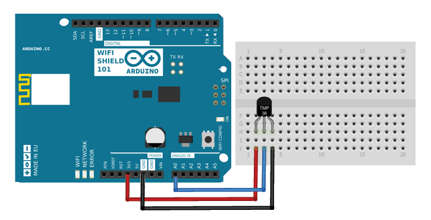

.. _ref_tutorial_intro:

#########
Tutorials
#########

*******
Arduino
*******

.. image:: _static/tutorials/arduinozero_wifi101.png
	:width: 70%
	:align: center

This is a quick example using **Arduino Zero** to send data to Tago.
For the connectivity board, we selected the shield **Atmel WiFi101**.
To learn about the Arduino Zero and how to get started, click `here. <https://www.arduino.cc/en/Guide/ArduinoZero>`_

In this example, let's send the temperature reading from the Arduino to Tago. We will visualize the temperature in the dashboard, and use
the actions capability to send e-mails when the temperature reaches a threshold.

Diagram
*******

Adding the Device
*****************

Log in your account, click on Devices (side bar), then click on 'Add Device' blue button.
The Arduino board will be the device to be added, we will give it the name 'dev01'. Therefore, enter with the name 'dev01' and click on 'Save'.

For each device, you have to define a :ref:`bucket <ref_concepts_bucket>` to store its data. You can let Tago to create a new bucket with the same name as the device.

All devices should use a valid :ref:`token <ref_concepts_token>` when accessing Tago. This token is automatically generated when a device is created.
Go to the 'General information' session of the device, click on 'QR Code' or 'Tokens' and copy the token to be added in the Arduino code later.

.. raw:: html

	<video style="max-width: 100%;" src="_static/getstarted/add_device.mp4" autobuffer controls></video>  

Building the Dashboard
**********************

Let's build a simple :ref:`dashboard <ref_dashboard_dashboard>` to visualize the data sent by your Arduino. Click '+ New Dashboard' on the left side bar, type the name of your dashboard, and click on 'Create'.
Let's add one widget to show the variable *temperature*. Click on 'Add Widget' blue bottom and pick the widget *Dial*.

Start the configuration of this widget by adding the variable to be displayed.
Type the variable name that will be sent by the device as 'temperature', click on 'add' below the name. Select your bucket [dev01], your device [dev01], and click 'OK'.
Then, click 'Create', and your widget will be ready!

.. raw:: html

	<video style="max-width: 100%;" src="_static/tutorials/add_var_dash.mp4" autobuffer controls></video>  

Great! As soon as your device start to send data, the values will be showed on this dial.

Sending e-mail
**************

Now, let's add an :ref:`action <ref_actions_define_actions>` to send an e-mail notification when the sensor overheat.
First, create an action for the device:

.. image:: _static/tutorials/create_actions.png
	:width: 80%
	:align: center

.. image:: _static/tutorials/action_name.png
	:width: 50%
	:align: center

Configure the action to send the e-mail, enter with the destination e-mail address in the 'To' field, and the Subject. Tago can include dynamic variables in the body of the message! For example, using $VALUE$ in the message, we can send the last temperature value with the text.
An e-mail body written as: ``Hi, the temperature is $VALUE$``, could in fact send an e-mail like: ``Hi, the temperature is 26.5``

.. image:: _static/tutorials/action_defined.png
	:width: 70%
	:align: center

To make sure that you will receive only one notification each time the temperature passes the threshold, we will define values to **Set** and **Reset** the trigger. It will create a hysteresis function to prevent the system from sending e-mails continuously.
Basically, we just need to configure Set Trigger and Reset Trigger as showed below.
You can change the threshold values later, by now, let's send an e-mail when the temperature goes over 50C and reset the trigger when it goes back to less than 30C.

.. image:: _static/tutorials/trigger_set.png
	:width: 70%
	:align: center

Sending data from Arduino
*************************

Your setup is ready at Tago! Now, you just need to code your Arduino to send the data to Tago.

When communicating with devices, Tago uses the JSON format. For example, to send the temperature @ 26.5C, the device just need to POST the data like:

.. code-block:: json

	{
	    "variable": "temperature",
	    "value": "26.5",
	    "unit": "C",
	    "time": "2015-11-23 03:43:59"
	}

There is no need to send all the JSON fields. For example, if you don't send the 'time', Tago will automatically stamp the data with the time it arrived at the server (UTC).

Arduino Code
============

	.. code-block:: javascript

	  {
	    console.log(meu teste)
	  }

Running the application
***********************

Open your dashboard, and run the code in your Arduino board. Note the widget display the value in realtime.
Try to heat the sensor to reach the 50C. You should then receive an e-mail from Tago. Cool down the sensor below 30C, and try again!
If you have any issue or question about this application, access our `Forum <https://community.tago.io/>`_ .

Conclusion
**********

That was a very simple example that showed how easy and quick is to set the ecosystem around Tago and your device.
To extract more from Tago, check out this :ref:`tutorial <ref_tutorials_advanced_arduino>` . Here you will be able to
send and receive data from Tago, run scripts in the Analysis and combine data.

.. _ref_tutorials_advanced_arduino:

******************
Arduino - Advanced
******************

** COMING SOON **

*****************
Beagle Bone Black
*****************

.. image:: _static/tutorials/BBB.jpg
	:width: 70%
	:align: center

This simple tutorial using the **Beagle Bone Black - BBB** board will show you some principles to integrate your solution with Tago. More than just connect the BBB to the cloud, you will learn how to easily reuse this code into your own application later.

In this example, let's send the status of a switch (open/closed) connected to a digital input from a BBB board. We will visualize its status in the dashboard. And through the Actions capability, we will configure the system to send out an e-mail whenever the status changes to *open*.

Diagram
*******

The circuit is pretty simple as we are using only one digital input connected to a normally open switch (connector P8, pin 19). A 2.2k Ohm resistor keeps the signal at state low when the switch is open.

.. image:: _static/tutorials/bbb_switch.png
	:width: 50%
	:align: center

Adding the Device
*****************

Log in your account, click on Devices (side bar), then click on 'Add Device' blue button.
The BBB board will be the device to be added, we will give it the name 'dev01'. Therefore, enter with the name 'dev01' and click on 'Save'.

For each device, you have to define a :ref:`bucket <ref_concepts_bucket>` to store its data. You can let Tago to create a new bucket with the same name as the device.

All devices should use a valid :ref:`token <ref_concepts_token>` when accessing Tago. This token is automatically generated when a device is created.
Go to the 'General information' session of the device, click on 'QR Code' or 'Tokens' and copy the token to be added into the BBB code later.

.. raw:: html

	<video style="max-width: 100%;" src="_static/getstarted/add_device.mp4" autobuffer controls></video>  

Building the Dashboard
**********************

Let's build a simple :ref:`dashboard <ref_dashboard_dashboard>` to visualize the data sent by BBB. Click '+ New Dashboard' on the left side bar, type the name of your dashboard, and click on 'Create'.
Let's add one widget to show the variable *switch* (open/closed). Click on 'Add Widget' blue bottom and pick the widget *Display*.

Start the configuration of this widget by adding the variable to be displayed.
Type the variable name that will be sent by the device as 'switch', click on 'add' below the name. Select your bucket [dev01], your device [dev01], and click 'OK'.
Then, click 'Create', and your widget will be ready!

.. raw:: html

	<video style="max-width: 100%;" src="_static/tutorials/dash_bbb.mp4" autobuffer controls></video>  

Your dashboard will look like this one:

.. image:: _static/tutorials/dash_bbb1.png
	:width: 50%
	:align: center

Great! As soon as your device start to send data, the values will be showed on this display.

Sending e-mail
**************

Now, let's add an :ref:`action <ref_actions_define_actions>` to send an e-mail notification when the switch sensor is opened.
First, create an action for the device:

.. image:: _static/tutorials/create_actions.png
	:width: 80%
	:align: center

.. image:: _static/tutorials/action_name.png
	:width: 50%
	:align: center

Configure the action to *send e-mail*, enter with the destination e-mail address in the *To* field, and the *Subject*. You can enter with a message that will say something like: ``Hi, the switch on your BBB is open!``.

.. image:: _static/tutorials/bbb_email_config.png
	:width: 70%
	:align: center

To make sure that you will receive only one notification each time the switch changes status, we will define values to **Set** and **Reset** the trigger. It will create a hysteresis function to prevent the system from sending e-mails continuously.
Basically, we just need to configure Set Trigger and Reset Trigger as showed below.
Let's **Set trigger** to send an e-mail when the sensor is *open* and **Reset trigger** when it goes back to *closed*. So, if another data with *open* status is sent before it goes back to *closed*, it will not send the e-mail.

.. image:: _static/tutorials/trigger_bbb.png
	:width: 70%
	:align: center

Sending data from BBB
*********************

Your setup at Tago is ready! Now, you just need to code your BBB to send the data.

When communicating with devices, Tago uses the `JSON <http://json-schema.org/example1.html>`_  format. For example, to send the information that the switch is open, the device just needs to make a POST in HTTP using the data like:

	.. code-block:: json

		{
		    "variable": "switch",
		    "value": "open",
		}

Yep! That is all!  You can add a lot of more information with the variable, like its location, time, and unit. Several fields can be added with the data when using our :ref:`API's <ref_api_api>`.

Python Code
===========

The code developed for this example was done in `Python <https://www.python.org/>`_. You can code in other languages, such as C, C# or Node.js. Using Debian distribution installed in the BBB, and Python 2.7.9, we wrote and tested the code below. You should have no problem with a different linux distributions or Python versions.

In case you need some background about how to instal and run Python on a BBB, visit these sites from `beaglebone.org <http://beagleboard.org/getting-started>`_ and `adafruit <https://learn.adafruit.com/setting-up-io-python-library-on-beaglebone-black>`_ .

.. code-block:: python

	from tago import Tago
	import Adafruit_BBIO.GPIO as GPIO

	MY_DEVICE_TOKEN = ' ###  PLACE THE TOKEN FOR YOUR DEVICE HERE ###'
	my_device = Tago(MY_DEVICE_TOKEN).device

	send_close = {
	    'variable' : 'switch',
	    'value'    : 'closed'
	}

	send_open = {
	    'variable' : 'switch',
	    'value'    : 'open'
	}

	event_detected = False
	LOW = 0
	HIGH = 1

	GPIO.setup("P9_12", GPIO.IN)
	if GPIO.input("P9_12"): Level = HIGH
	else:   Level = LOW

	while True:
	        if Level == LOW:
	                if GPIO.input("P9_12"):
	                        data_to_insert = send_close
	                        Level = HIGH
	                        event_detected = True

	        else:
	                if GPIO.input("P9_12") == LOW :
	                        data_to_insert = send_open
	                        Level = LOW
	                        event_detected = True

	        if event_detected :
	                event_detected = False
	                result = my_device.insert(data_to_insert)
	                if result['status']:
	                        print 'Response: ', result
	                else:
	                        print result['result']

As we know that you will want to apply this in your own application later, here goes some tips for your code:

 | 1. import the Tago lib for Python. Also, we have libs for several languages to simplify your code, check out ours :ref:`SDKs <ref_sdk_sdk>`
 		``from tago import Tago``
 | 2. replace MY_DEVICE_TOKEN with the token created for your device
		``MY_DEVICE_TOKEN = ###  PLACE THE TOKEN FOR YOUR DEVICE HERE ###``
 | 3. prepare a JSON with the data to be sent

	.. code-block:: python

		send_open = {
		 	'variable' : 'switch',
		 	'value'    : 'open'
 		}

 | 4. send your data to Tago
 	``result = my_device.insert(data_to_insert)``
 | 5. treat the API response to check for success or error.

	.. code-block:: python

		if result['status']:
			print 'Response: ', result
		else:
			print result['result']

Running the application
***********************

Look at your dashboard at Tago, and run the code in your BBB. Note the widget will display the value of the variable in realtime.
Wait few seconds for the Python to start the program and press the button on the switch. You should then receive an e-mail from Tago. Release the button, and you will see the status on the display. Press again, and receive another e-mail ;-)
If you have any issue or question about this application, access our `Forum <https://community.tago.io/>`_ .

Right, we know... it was not a very exciting application for a good use of a BBB and Tago. But at least, we hope it gave you a good idea about how to set the ecosystem around Tago and your device easily.
To get more from Tago and your BBB, check out the new :ref:`tutorial <ref_tutorials_advanced_bbb> soon` . There you will be able to
send and receive data from Tago, run scripts in the Analysis and combine data.
